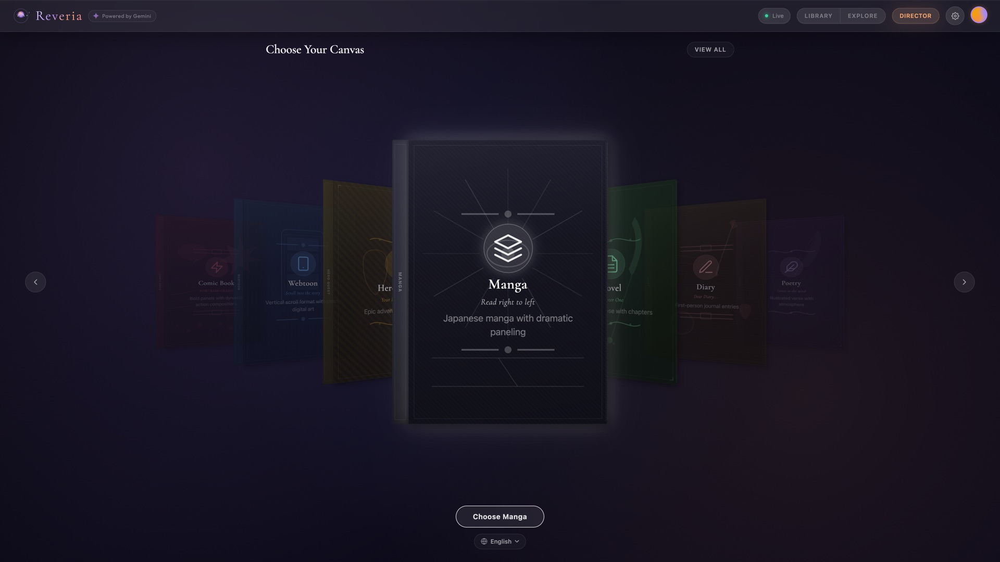
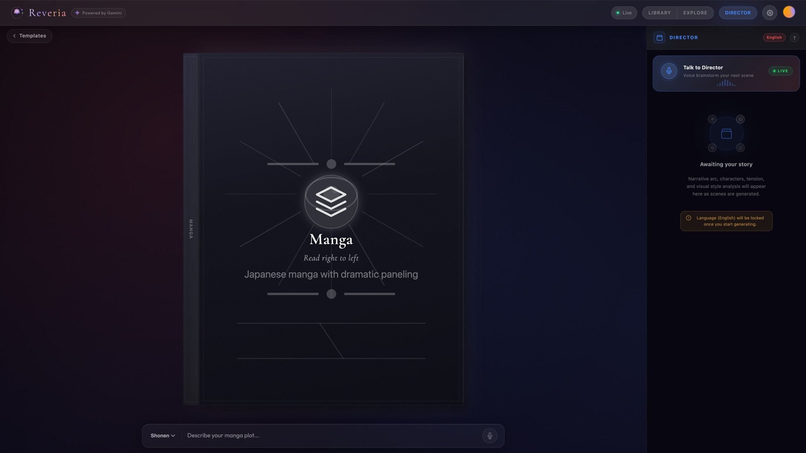
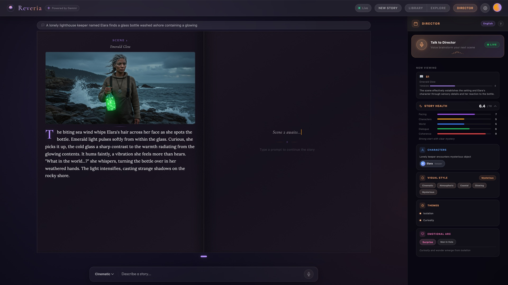
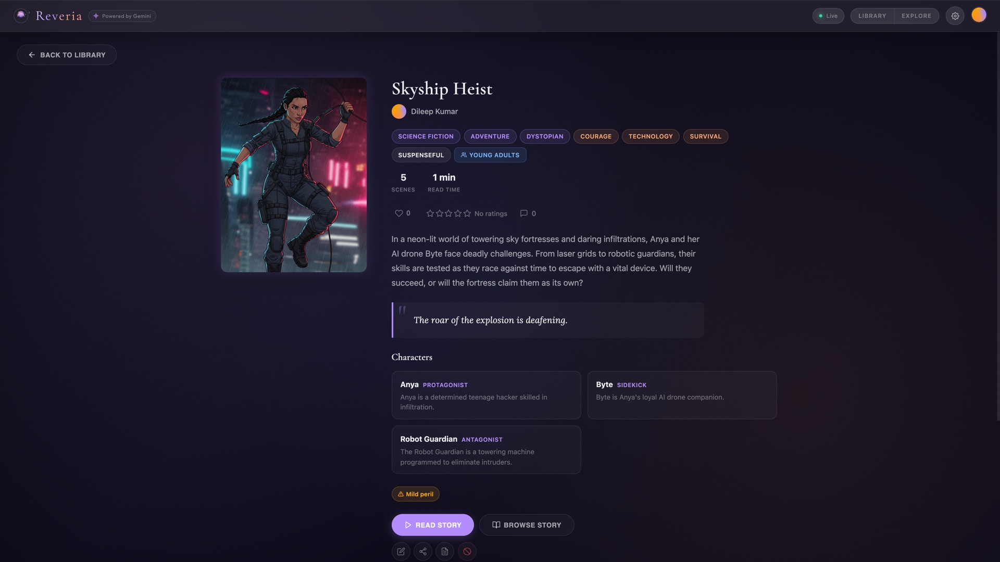

# Building Reveria: How We Built an AI Story Engine with Gemini

*Describe a story. Watch it come alive. That's the pitch. Here's how we actually built it.*

> **Disclosure:** This blog post was created for the purposes of entering the [Gemini Live Agent Challenge](https://devpost.com/) hackathon. #GeminiLiveAgentChallenge

---

## What is Reveria?

Reveria is an interactive story engine. You type (or say) something like "a noir detective story in a rain-soaked city at midnight," and it generates an illustrated storybook in real time: narrative text, scene illustrations, voice narration, and an interactive flipbook you can page through. Everything streams in live as four AI agents work in parallel.

What makes it different from "give me a story" ChatGPT wrappers is the **Director Chat**. You open a voice conversation with an AI Director character, brainstorm your story idea out loud, and when the Director decides you're ready, it triggers generation automatically. During generation, the Director watches each scene being written and offers creative analysis in real time. It's not just observing. It suggests what should happen next, and the Narrator picks up that suggestion in the following scene. Two agents shaping a story together, with you steering.

The other thing worth noting: this isn't a single API call. It's a multi-agent pipeline built on Google's Agent Development Kit (ADK), with Gemini 2.0 Flash for text, Imagen 3 for illustrations, Gemini Live API for voice, and Gemini Native Audio for narration. Each agent runs at a different temperature tuned for its task. The result feels less like "AI generated this" and more like watching a creative team work.

Beyond generation, Reveria is a full application: a Library for your saved stories, an Explore page for discovering published work from other users, Reading Mode with karaoke-style narration, PDF export, 8-language support, 9 story templates, 30+ art styles, social features (likes, ratings, comments), and share links for public viewing.

**Live app**: [reveria.web.app](https://reveria.web.app) | **Source**: [github.com/Dileep2896/reveria](https://github.com/Dileep2896/reveria)


*9 story templates, from Storybook to Manga to Photo Journal*

---

## System Architecture

Reveria runs four specialist agents coordinated by ADK's `SequentialAgent`:

```
StoryOrchestrator (SequentialAgent)
  +-- NarratorADKAgent (per-scene streaming loop)
  |     |
  |     +-- Scene 1 text ready --+-- asyncio.create_task(Illustrator)  < image gen
  |     |                        +-- asyncio.create_task(TTS)          < audio gen
  |     |                        +-- asyncio.create_task(Director Live) < commentary
  |     |
  |     +-- [Check steering queue > inject user direction]
  |     |
  |     +-- Scene 2 text ready --+-- asyncio.create_task(Illustrator)
  |     |                        +-- asyncio.create_task(TTS)
  |     |                        +-- asyncio.create_task(Director Live)
  |     |
  |     +-- await all pending tasks
  |
  +-- PostNarrationAgent (ParallelAgent)
        +-- Director Agent     < full post-batch analysis
```

The key design decision: **different temperatures for different tasks**. Story writing needs high creativity (temp 0.9). Image prompts need precision (temp 0.3). Character extraction needs determinism (temp 0.1). Director analysis needs structured JSON output (temp 0.3). A single Gemini call can't do all of these well. By splitting them into separate agents with tuned parameters, each does its job without compromising the others.

Each prompt generates exactly one scene. This keeps the feedback loop tight: describe what you want, watch it materialize, steer, repeat. No batch of five scenes where the third one goes off the rails. The user is always one prompt away from the next scene, making the creative process feel like a conversation rather than a batch job.

**Everything streams over a single WebSocket.** Story generation takes 15-30 seconds end-to-end. Making the user wait for a complete response would be terrible UX. Instead, text arrives chunk-by-chunk as Gemini generates it, images arrive as soon as Imagen completes each scene, audio arrives per-scene from Gemini Native Audio, and Director analysis arrives as structured JSON. The frontend renders each modality as it arrives.



---

## The Build

The project came together in roughly three phases.

**Week 1** was about proving the core pipeline. Day 1: can we get Gemini to generate story text, stream it over WebSocket, split it into scenes, and render it in a flipbook? The answer was yes, and by end of day we had text streaming into an interactive book. Day 2 brought the first big challenge: image generation. Imagen 3 produces stunning illustrations, but characters looked completely different across scenes. Day 3 was the Firebase integration marathon: auth, Firestore persistence, save flows, Library, URL routing, all the infrastructure that makes it a real application.

**Week 2** was about solving character consistency (described in detail below), building Director Mode with live commentary, adding templates and art styles, and getting per-scene streaming working so the experience felt truly live.

**Week 3** was the Director Chat integration with the Gemini Live API, the safety and content filtering system, social features, multi-language support, Reading Mode, the CI/CD pipeline, and a lot of polish. The interaction-flow audit at the end caught 9 bugs that would have been embarrassing in production, including silently dropping Live API tool calls and losing user quota on WebSocket disconnects.

---

## The Biggest Challenge: Character Consistency

This was the hardest technical problem we solved, and the one I'm most proud of.

### The Naive Approach

```
Scene text > Gemini ("write an image prompt") > 100-word prompt > Imagen
```

Gemini would receive a scene about "Elena, a woman in her late 20s with pale skin, long dark wavy hair, green eyes, wearing a high-collar black Victorian dress" and compress it to "woman in dark dress" to fit the word limit. Imagen had no idea what Elena actually looked like. Characters changed faces, hair color, and outfits between every scene.

### The Fix: Hybrid Prompt Construction

We split the image prompt into two stages. Gemini writes the scene composition only, then we **programmatically prepend** character descriptions from a reference sheet:

1. **Character Sheet Extraction** (Gemini, temp 0.1): reads the full story and outputs structured character descriptions with hex color codes, face shapes, signature items, and dominant palette (capped at 1000 tokens)
2. **Character Identification** (Gemini, temp 0.0): identifies which characters appear in each specific scene
3. **Scene Composition** (Gemini, temp 0.3): writes ONLY the setting, lighting, mood, camera angle (100 word limit). Explicitly told "do NOT describe characters"
4. **Assembly**: character descriptions + anti-drift anchor + scene composition + art style suffix, concatenated programmatically

The final prompt sent to Imagen contains **100% of the character visual details**, nothing lost to summarization:

```
Elena: [gender: woman], [age: late 20s], [skin: pale ivory #F5E6D3],
[hair: dark wavy #2A1810 shoulder-length], [face: oval, green #4A7C59 eyes,
high cheekbones], [outfit: black #1A1A2E Victorian dress, silver moon pendant],
[signature items: silver moon pendant, lace gloves],
[palette: #1A1A2E, #F5E6D3, #4A7C59, #C0C0C0]

IMPORTANT: Render each character EXACTLY as described above - same colors,
same outfit, same signature items. Do not alter, omit, or reinterpret
any character detail.

Elena stands at the edge of a moonlit cliff, wind catching her dress.
Fog rolls below, a distant lighthouse beam sweeps across the water.
Low angle, dramatic backlighting, cinematic digital painting,
highly detailed, dramatic volumetric lighting, depth of field,
rich color grading, photorealistic textures, 8k render quality.
```

This was the breakthrough moment. Characters suddenly looked consistent across 4, 6, 8 scenes. The hex color codes give Imagen specific, unambiguous visual targets instead of subjective descriptions like "pretty woman in dark clothing." The anti-drift anchor fights the tendency of image models to "drift" from reference descriptions, especially in complex multi-character scenes.

### Anchor Portraits and Visual DNA

We pushed this further with **anchor portraits**. Before generating any scene images, the Illustrator creates a 1:1 close-up portrait of each named character via Imagen 3, then feeds that portrait to Gemini Vision for visual DNA extraction.

Visual DNA is a 100-150 word natural-language description of exactly what Imagen rendered: skin tone, hair texture, facial features, clothing details, color palette. Extracted at temperature 0.1 for maximum precision. This description becomes the character's ground truth for all subsequent scene images, replacing the raw character sheet with descriptions anchored to an actual rendered image.

The pipeline flow:
1. **Portrait generation**: Imagen renders a character close-up from the character sheet description
2. **Visual DNA extraction**: Gemini Vision analyzes the portrait and produces a detailed description of what it sees
3. **Scene composition**: subsequent scene prompts use the visual DNA (not the original text description) for character references
4. **Persistence**: Visual DNA serializes with the Illustrator's state; portraits persist to Firestore via `ArrayUnion`

The hero character is skipped for anchor portraits (since the user may have a reference photo), and post-batch portraits deduplicate against anchors to avoid redundant Imagen calls. The result: characters that look recognizably like *themselves* across every scene, because every prompt references a description derived from a real rendered image rather than abstract text.

---

## Director Chat: Talking to Your Story's AI Director

This is the feature I'm most excited about. Director Chat is a real-time voice conversation with an AI Director character, built on the Gemini Live API (`gemini-live-2.5-flash-native-audio`).

### How It Works

1. **Start session**: Frontend sends story context, language, and voice preference. Backend opens a persistent bidirectional Gemini Live session configured with function calling, native audio transcription, and context window compression. The Director's audio greeting plays back.
2. **Conversation**: User speaks. Web Audio's `AnalyserNode` computes RMS levels on a 100ms polling interval and detects 800ms of silence to auto-stop the recorder. Base64 audio goes over WebSocket to the Live session. Response audio, transcripts, and any tool calls come back.
3. **Tool-driven generation**: When the model decides brainstorming is done, it calls the `generate_story` tool with a vivid 2-3 sentence prompt. The backend sends a `FunctionResponse` back so the model can say "Generating your story now!", then fires generation.
4. **Manual fallback**: A "Suggest" button calls `request_suggestion()` directly on the existing session. This handles the ~30-40% of cases where tool calling doesn't fire in audio mode.



### The Tool Declaration

The system prompt conditioning is critical for reliability:

```python
GENERATE_STORY_TOOL = types.FunctionDeclaration(
    name="generate_story",
    description="Generate an illustrated story scene. Call ONLY when brainstorming is "
                "complete and the user has explicitly confirmed they are ready.",
    parameters=types.Schema(
        type="OBJECT",
        properties={
            "prompt": types.Schema(
                type="STRING",
                description="Vivid 2-3 sentence story prompt distilled from brainstorming",
            ),
        },
        required=["prompt"],
    ),
)
```

The system prompt reinforces when to call it:

```
Call generate_story ONLY when ALL of these are true:
1. The brainstorming has produced a clear story direction
2. The user has explicitly confirmed they want to proceed
3. You are NOT still asking follow-up questions
4. The user is NOT still exploring alternatives
```

This pattern of using the model's native function calling instead of building external classifiers applies broadly. The model *having* the conversation has far better context than an external model *analyzing* lossy transcriptions of it.

### Zero Extra API Calls

The previous architecture made 3-5 separate Gemini calls per user interaction:

| Step | API Call | Purpose |
|------|----------|---------|
| 1 | Gemini Live | Conversation (audio in/out) |
| 2 | `transcribe_audio()` | User speech to text |
| 3 | `transcribe_audio()` | Director speech to text |
| 4 | `detect_intent()` (Gemini Flash) | "generate" vs "continue" |
| 5 | `suggest_prompt()` (Gemini Flash) | Conversation to story prompt |

This caused noticeable latency, wasted API quota, and introduced race conditions. The `generation_triggered` boolean had no lock and never reset after generation completed. Once it flipped to `True`, auto-generation was permanently disabled for that session.

The rewrite eliminated all extra calls by using three native Live API features:

- **`input_audio_transcription` / `output_audio_transcription`**: transcriptions arrive in the receive stream alongside audio chunks. No separate STT calls.
- **Function calling (`tools`)**: we declared `generate_story` as a tool. The model, which has full conversational context, decides when to call it. This replaced the external classifier working from lossy transcriptions.
- **`context_window_compression`**: a sliding window at the API level handles long brainstorming sessions. Combined with a local `_trim_log()` capping at 20 entries, no unbounded memory growth.

### VAD: The UX Breakthrough

Without voice activity detection, users had to tap twice per turn (record, then send). With Web Audio's `AnalyserNode` computing RMS from `getFloatTimeDomainData()`, we detect the speech-to-silence transition and auto-stop the recorder. The conversation becomes: speak, pause, Director responds, speak again. One tap to start, zero taps per subsequent turn.

### Language-Aware Director

The Director speaks the story's language. For non-English stories, language directives are appended to the system prompt. Combined with configurable voice selection (8 voices from Charon to Zephyr, persisted in `localStorage`), users get a personalized creative collaborator.

### During Generation

When the Director triggers story generation, its voice orb switches to a "watching" state (eye icon with accent-primary pulse). Per-scene `proactive_comment()` voice messages are skipped to prevent audio overlap. Only `generation_wrapup()` fires at the end with a combined reaction covering all generated scenes plus a continuation prompt. Recording auto-resumes 800ms after generation completes.

### Streaming Audio: Eliminating the "Thinking" Gap

The original Director Chat had a noticeable delay between when you stopped speaking and when the Director started responding. The full audio response had to be collected, encoded as a WAV, and sent as a data URL before playback could begin.

The fix: stream PCM audio chunks incrementally. The backend's `collect_response_streaming()` calls an `on_audio_chunk` callback for each audio chunk as it arrives from the Gemini Live API. Each chunk is base64-encoded and sent as a `director_chat_audio_chunk` WebSocket message. On the frontend, `useStreamingAudio` feeds each chunk into a Web Audio API `AudioBufferSource`, scheduled for gapless playback via a `nextPlayTime` tracker. The Director's voice starts playing as soon as the first chunk arrives — typically within 200-400ms of the request.

The two audio paths coexist cleanly. Streaming handles normal conversational responses. The legacy `Audio(dataUrl)` path handles greetings (session start) and tool call acknowledgments, which still use the non-streaming endpoint.

### Mute: Stopping Director Audio

Tapping the voice orb while the Director is speaking immediately stops all audio playback — both streaming PCM and legacy Audio elements. Recording resumes automatically so the user can speak next. Simple, reliable, no false triggers from background noise.

### Silent User Re-Engagement

A subtle UX problem: the Director greets you, the mic goes hot, and... you don't speak. Maybe you're thinking. Maybe you're confused about what to do next. The VAD auto-stop only triggers after speech→silence, so no speech means the recording runs forever, the orb sits in "recording" state, and nothing happens. Dead end.

The solution uses a 10-second idle timeout in `useVoiceCapture.js`. If the VAD never detects speech (RMS never crosses the threshold), the recording silently aborts and fires an `onIdleTimeout` callback. In `DirectorChat.jsx`, this sends a silent system message to the Director — invisible in the chat transcript — asking it to re-engage the user with a creative question or story suggestion. A dedup guard ensures only one nudge per silence period, resetting when the user actually speaks.

The Director doesn't know you're silent — it just gets a gentle prompt to be more engaging. From the user's perspective, the Director seems to sense the pause and offers help.

### Voice-Reactive Orb

The voice orb went from a CSS-animated circle to a living, breathing canvas blob that reacts to actual audio amplitude.

`VoiceOrb.jsx` renders 8 control points arranged in a circle, displaced by pseudo-noise (overlapping sine waves at irrational frequency ratios — no external library needed), and connected via Catmull-Rom spline interpolation for smooth curves. Real-time amplitude from the mic's `AnalyserNode` (when recording) or the streaming audio's `AnalyserNode` (when the Director speaks) drives the deformation magnitude and noise traversal speed.

The key to making it feel alive: **asymmetric smoothing**. Fast attack (0.25-0.35) makes it responsive to voice onset. Slow decay (0.05-0.1) creates a natural tail-off between words, so the blob doesn't jitter between syllables. Six visual modes blend smoothly via per-frame lerping: idle (gentle violet breathing), recording (red, erratic, high amplitude response), speaking (amber, confident, smooth motion), loading (subtle violet drift), watching (calm pulse during generation), and waiting (amber shimmer during hero photo analysis).

Three layers create depth at minimal GPU cost: an outer glow blob (CSS blur), the main radial-gradient blob (canvas), and an inner specular highlight (canvas). The icon overlay fades out during the `speaking` state — the blob itself becomes the visualization. At 72px with DPR capped at 2, it's 144x144 pixels of canvas fill per frame. Negligible.



*Voice brainstorming with the Director, then watching generation unfold*

---

## Per-Scene Streaming: Making It Feel Alive

The original pipeline was batch-sequential: Narrator generates ALL scene text, then Illustrator generates ALL images, then TTS generates ALL audio, then Director analyzes. Users stared at a spinner for 15-30 seconds before seeing anything.

The rewrite fires image, audio, and Director commentary tasks **per-scene** as each scene's text completes inside the Narrator loop. Scene 1's image paints in while Scene 2's text is still streaming.

### Implementation Details

- **Image semaphore**: Imagen has rate limits, so a module-level `asyncio.Semaphore(1)` serializes image calls. But they start as soon as each scene's text is ready, not after all scenes finish.
- **Character extraction**: Runs once when the first scene arrives (needs at least one scene's text), then all subsequent scenes use the cached character sheet.
- **Task collection**: All spawned tasks are gathered via `await asyncio.gather(*pending_tasks)` after the Narrator loop completes, ensuring nothing is dropped.
- **Non-blocking WebSocket loop**: `handle_generate` runs as `asyncio.create_task()` so the WebSocket loop stays responsive. Users can send steer/director/regen messages while generation is active.
- **Mid-generation steering**: Users can type direction changes ("make it scarier") while generation runs. The message goes as `type: "steer"` over WebSocket. Backend pushes it to `SharedPipelineState.steering_queue`, checked between scenes in the Narrator loop via `.get_nowait()`. The steering text is injected into the Narrator's conversation history as a user message, so the next scene naturally picks up the new direction.

The UX signals steering mode clearly: the placeholder changes to "Steer the story... (e.g. make it scarier)", the send button morphs from a spinner to a compass icon, and a toast confirms "Steering applied: make it scarier."

The UX difference from the old batch pipeline is dramatic. Users see results streaming in continuously instead of waiting for phase transitions. Text flows in, images "paint" in with a shimmer effect, audio becomes playable. It feels like watching a creative team work, not waiting for a batch job.

### Director Mode Panel

The right panel shows the AI's creative reasoning in real time. After the full post-batch analysis arrives, it displays:

- **Narrative Arc**: story structure stage (exposition, rising action, climax, resolution) with pacing indicators
- **Characters**: cast list with roles and personality traits
- **Tension**: bar chart visualization showing tension levels across scenes with trend arrows
- **Visual Style**: mood tags and color palette analysis

This isn't just a debugging tool. It makes the AI's decision-making transparent and educational.

### Director Live Commentary

Each scene triggers a lightweight Gemini Flash analysis (temp 0.3, 300 tokens, JSON response) that streams to the Director panel in real time:

```json
{
  "scene_number": 1,
  "thought": "Opening with rain-soaked streets creates immediate noir atmosphere",
  "mood": "mysterious",
  "tension_level": 4,
  "craft_note": "Strong use of pathetic fallacy",
  "suggestion": "Reveal that the stranger watching from the alley is her long-lost sister",
  "emoji": "rain"
}
```

The frontend renders these as animated cards with mood badges, tension meters, and italic craft notes.

That `suggestion` field is the interesting part. It's stored on `SharedPipelineState.director_suggestion` and prepended to the Narrator's input at the start of the next batch as `[Director's creative direction: ...]`. The Director doesn't just observe. It drives. It spots an opportunity ("Reveal that the stranger is her long-lost sister"), and the Narrator runs with it.

This transforms the Director from a reactive analyst into a proactive creative collaborator, like a real film director calling the next shot between takes. The user can see the suggestion in the Director Panel, watch the Narrator pick it up, and feel the story being shaped by a creative partnership rather than a single author.


*Live story generation with Director analysis panel*

---

## Visual Narratives: Comics, Manga, and Webtoons

Templates aren't skins. Each one reshapes the entire pipeline. A Manga template doesn't just swap the art style suffix. It changes the scene composer to use character-dominant framing, activates the text-free image defense, adjusts TTS to narrate only overlay text (not full prose), and shifts the Narrator toward visual storytelling with shorter scene descriptions.

The template selector uses a 3D coverflow carousel. Each card tilts in perspective as you scroll, with the active template front-and-center. When you select a template, the art style dropdown filters to curated styles, the Narrator's system prompt adapts its tone (fairy tales get "Once upon a time" pacing; noir gets clipped, hard-boiled prose), and the scene composer switches composition instructions.

### Art Styles Per Template

Each template curates a subset of the 30+ available art styles that suit its format. Manga templates surface ink-and-screentone styles. Storybook templates surface watercolor and painterly styles. Comic Book surfaces classic comic and noir options. This keeps the dropdown focused rather than overwhelming users with 30+ choices that mostly don't fit their chosen format.

The art style suffix itself is 20-25 words of rendering-specific detail. Not just "watercolor" but "traditional watercolor illustration, soft translucent washes, visible paper texture, delicate wet-on-wet brushstrokes, gentle color bleeding at edges, hand-painted look, luminous highlights, muted pastel palette." These details give Imagen concrete visual targets.

### The Text-in-Image Problem

Comic art styles triggered Imagen to render speech bubbles and sound effects directly into generated images. Phrases like "comic book panel art" and "graphic novel style" are strong textual signals to Imagen. The result was garbled AI text baked into otherwise beautiful illustrations.

Our solution is a **triple-layer defense**:

1. **Scene composer instruction**: explicitly tells Gemini to compose scenes without text, captions, or speech bubbles
2. **Positive "Text-free panel art:" prefix**: prepended at the very start of the Imagen prompt, where attention weight is highest
3. **Art style suffix**: every visual narrative style includes "text-free panel art" in its suffix

A negative constraint `[NO text, NO speech bubbles, NO dialog bubbles, NO captions, NO letters]` is appended at the END. We learned the hard way that putting negative constraints first consumed Imagen's attention budget and pushed character descriptions too far down, degrading consistency.

All text overlay (narration captions, dialogue, sound effects) is handled by the app itself, using Gemini Vision to determine optimal placement on the clean generated image.

### Character Framing

Our first comic generations looked stunning but empty. Beautiful cityscapes and dramatic laboratories, all without a single character. The scene composer was optimized for storybook layouts where characters share space with prose. For comics, characters need to dominate at least 60% of the frame.

A dedicated `VISUAL_NARRATIVE_SCENE_COMPOSER_INSTRUCTION` classifies whether a scene has characters or is setting-only, then applies different composition rules. When character identification returns empty (common for short 30-50 word comic scenes), we inject the full character sheet if the scene contains dialogue or name references. Characters don't vanish from their own story.

### Split DNA for Outfit Changes

When a scene describes a character changing clothes ("she donned the armor"), the character sheet's outfit description conflicts with the narrative. The image ends up with a confused hybrid. We split character descriptions into **physical traits** (face, hair, skin, build, permanent) and **style traits** (outfit, signature items, changeable). When the scene text contains outfit-change keywords (`wearing`, `donned`, `changed into`, `disguise`), style traits are stripped, letting the scene's description take precedence while physical traits stay locked.

### Sequential Image-then-Audio

For storybook templates, image and audio run in parallel per-scene. Visual narratives need a different pipeline: the text shown to the user is condensed overlay text (~20 words), not full prose (~50 words). TTS should narrate only what appears on screen.

Audio generation chains AFTER image generation for visual narratives. Once the image is ready and text overlays are determined, TTS narrates the overlay text sorted top-to-bottom, left-to-right. The user hears exactly what they read.

---

## The UI: Glassmorphism Meets Interactive Fiction

### The Flipbook

We use `react-pageflip` for realistic page-turn animations in always-spread mode. Every story displays as a two-page spread, like an open book. Each scene is a full page with a scene image (16:9, shimmer loading state), decorative drop-cap first letter, sentence-by-sentence reveal animation, compact audio player, and scene title in italic serif. Pages flip with arrow keys, dot navigation, or swipe gestures. The URL updates via `history.replaceState` so `/story/abc123?page=3` is bookmarkable.

### Cinematic Book Opening

New stories don't just appear. The first generation triggers a carefully choreographed entrance sequence that makes the book feel like a physical object coming to life:

1. **Closed-book illusion**: before generation, the book sits closed with a faux spine and `clip-path` masking that hides right-side pages. An idle violet glow pulses on the cover (`tc-idle-preparing` class), signaling something is about to happen.
2. **Entrance bloom** (600ms): the book scales in with a brightness bloom at 60% and slight overshoot, like it's materializing from imagination. The `bookEntrance` animation uses cubic-bezier easing for the overshoot.
3. **Overlapping flip** (starts at 350ms): before the entrance settles, the cover page begins flipping open via `flip(1)`. The entrance and flip overlap, creating one fluid motion rather than two distinct steps. The book appears *and* opens in a single breath.

The timing was critical. Earlier iterations had the entrance finish (700ms) before the flip started (800ms delay). A visible pause that broke the illusion entirely. Overlapping by starting the flip at 350ms eliminated the gap. A `firstGenFlipDone` ref tracks this cover-to-content flip so subsequent scene additions use the standard flip logic.

### Theme-Aware Book Shadows

Light mode exposed a sharp, dark shadow under the flipbook that looked wrong against the bright background. There were actually two sources: CSS box-shadow on `.stf__wrapper` (hardcoded `rgba(0,0,0,0.55)` that didn't adapt per theme), and `react-pageflip`'s own canvas-rendered shadow (invisible to CSS DevTools). The second source was the real culprit. Fixing it meant reading the current theme and setting `maxShadowOpacity` to 0.12 for light mode and 0.5 for dark. A good reminder that third-party libraries have hidden rendering layers that CSS inspection can't reach.

### Gemini Native Audio Narration

We replaced Cloud TTS with Gemini's native audio output for story narration. The difference is striking. Instead of robotic Wavenet voices reading text flatly, Gemini delivers audiobook-quality narration that varies tone with the story's mood. The system prompt instructs: "Vary your tone to match the mood: dramatic for tense moments, gentle for quiet scenes, energetic for action."

Each language gets a voice suited to it: Kore (warm) for English and Spanish, Leda (elegant) for French, Orus (calm) for German, Aoede (lyrical) for Japanese. The implementation mirrors our Director Chat architecture: open a short-lived Gemini Live session, pass the scene text with an audiobook narrator system prompt, and collect the PCM audio response.

### Reading Mode

Reading Mode transforms the storybook into a cinematic full-screen experience. When you click "Read" on a published or completed story, an overlay takes over with:

- **Word-by-word highlighting**: as the TTS audio plays, each word lights up in sync. The `timeupdate` event on the `<audio>` element drives the highlight position. Since Gemini's Live API doesn't provide word-level timestamps like Cloud TTS's SSML marks, we use a heuristic fallback that weights words by length and adds pauses at punctuation. It works well enough for the karaoke effect.
- **Auto-advance**: when a scene's narration ends, Reading Mode waits 1.5 seconds, then fades to the next scene.
- **Bookmarking**: reading position saves to Firestore for authenticated users, sessionStorage for guests.
- **Keyboard controls**: Space/Right for next scene, Left for previous, Escape to exit.
- **Segmented progress**: the bar at the top shows scene-by-scene progress, not just a single linear bar. You always know where you are in the story.

### The Save System

Saving a story needs an AI-generated title and cover image. But generating those takes 5-10 seconds. We can't make the user wait every time they click Save. Our solution:

- **Tier 1 (instant)**: If `title_generated` flag is set, just update status + timestamp. No API call.
- **Tier 2 (instant)**: If the background WebSocket task already delivered `bookMeta` (title, cover), use it immediately.
- **Tier 3 (async)**: No metadata available yet. Call the API, show "Generating cover..." spinner.

The background task starts automatically after the first generation completes. By the time most users click Save, the title and cover are already ready (Tier 1 or 2). The save feels instant.

### Art Styles as First-Class Citizens

We offer 30+ art styles, each with a rich suffix (20-25 words) including rendering-specific details:

```python
ART_STYLES = {
    "cinematic": "cinematic digital painting, highly detailed, dramatic volumetric "
                 "lighting, depth of field, rich color grading, photorealistic "
                 "textures, 8k render quality, concept art style...",
    "watercolor": "traditional watercolor illustration, soft translucent washes, "
                  "visible paper texture, delicate wet-on-wet brushstrokes, "
                  "gentle color bleeding at edges, hand-painted look...",
    "manga_ink": "black and white manga ink, precise clean linework, "
                 "screentone shading, dynamic foreshortening...",
}
```

The art style is appended to every scene prompt, used in cover generation, persisted per story in Firestore, and restored when reopening from the Library. Each template curates a subset of styles that suit its format. If you created a watercolor story last week, opening it today shows "Watercolor" in the dropdown, and new scenes match.

### Library and Social Features

Your personal bookshelf with 3D CSS book cards (perspective transforms, spine shadows, page edges). Books show AI-generated covers, status badges (Draft, Saved, Completed, Published), favorite hearts, and scene counts. While a cover is being generated, the book shows the scene image with a blur+grayscale filter and an animated "Painting cover..." overlay. When the AI cover arrives via WebSocket, the library auto-refreshes and the crisp cover appears.

The Explore page shows published stories from all users, sorted by publish date, with the same 3D book card layout. Each card shows the author's name and avatar (using Boring Avatars' marble variant for deterministic, beautiful fallbacks with zero network requests).

Published stories get a BookDetailsPage (`/book/:storyId`) with heart-based likes (optimistic `arrayUnion`/`arrayRemove`), 1-5 star ratings with hover preview (per-user upsert via a ratings subcollection, denormalized `rating_sum`/`rating_count` on the story doc), and threaded comments with author avatars, timestamps, and delete permissions (comment author and story author can both delete). Social stats are denormalized directly on the story document so they arrive with the initial fetch. No delayed pop-in, no second round-trip to a social endpoint for basic counts.


*Published story with characters, ratings, and social features*

---

## Additional Features

### PDF Export

Every saved story can be exported as a polished PDF storybook using `fpdf2`. The backend endpoint `GET /api/stories/{story_id}/pdf` downloads images from GCS, composites the PDF in memory, and returns it as a streaming response. Each story gets a full-bleed cover page with title and author overlaid, scene pages with illustrations and formatted text, decorative separators, consistent typography, centered page numbers, and a colophon with generation metadata. Access control ensures only the owner (or anyone for public stories) can download.

### Share Links and Public Viewing

Published stories get shareable URLs. Click Share and it copies `{origin}/story/{storyId}` to clipboard. When an unauthenticated user opens this URL, the frontend detects the missing auth, fetches `GET /api/public/stories/{storyId}` (no auth required), and renders StoryCanvas in read-only mode with no ControlBar, no Director Panel, and a "Sign in to create your own" banner. The backend sanitizes the response: no user UIDs, no narrator history, no internal state. Just the story content.

### Subscription Tiers

Reveria supports three tiers: Free, Standard, and Pro, each with different usage limits for daily generations, scene regenerations, and PDF exports. The interesting UX challenge was making Pro users *feel* premium without being gaudy.

We went with subtle visual indicators:
- **Avatar glow**: Pro users get a golden amber ring with a gentle pulse animation (`@keyframes proGlow`, 2.5s cycle). Standard users get a violet ring. Free users see the default glass border.
- **Tier pill**: the profile dropdown shows a small amber "PRO" badge with a star icon, or a violet "STANDARD" badge with a bolt icon. Free users see no pill. Cleaner.
- **Hidden usage counter**: Pro users don't see the "4/999" counter in the control bar. When your limit is effectively unlimited, showing it is just noise.

The best premium indicators are the ones users notice subconsciously. An admin dashboard lets us manage tiers: search users, view usage, and promote/demote between tiers.

---

## Safety and Content Filtering

AI models sometimes refuse requests they interpret as inappropriate. The problem: Gemini's refusal text ("I am programmed to be a harmless AI assistant...") would get rendered as actual story scenes, complete with AI-generated illustrations of the refusal message.

Our solution has two layers:

**Pre-pipeline validation**: A Gemini Flash classifier (`validate_prompt()`, temp 0, ~200ms) runs before the expensive generation pipeline. It classifies prompts as `STORY` or `REJECT`, catching coding questions, recipes, homework, and general knowledge queries in any language. It's multilingual by design, since Gemini Flash handles prompt classification across languages without needing per-language rules. It **fails open** on errors: if Gemini Flash has an issue, the prompt goes through rather than blocking a legitimate request. Better to occasionally process a non-story prompt than to block real stories.

**Post-generation pattern matching**: Expanded `is_refusal()` with patterns in Hindi, Spanish, French, German, and Japanese for edge cases where the narrator slips through the pre-filter. Both layers are needed: the pre-filter is cheap and catches most cases, the post-filter is the safety net.

For borderline content, the Narrator redirects in-character rather than breaking the fourth wall:

> "That part of the library is forbidden! Let's explore this mysterious path instead..."

The `ws_callback` is tuned to let these redirects play through as normal story content. Only off-topic refusals (coding questions, homework) trigger a hard error toast. The experience stays immersive.

---

## Multi-Language Support

Reveria generates stories in 8 languages: English, Spanish, French, German, Japanese, Hindi, Portuguese, and Chinese. Language is a pipeline-level concern, not a per-component feature. It flows through `SharedPipelineState` and touches every agent:

1. **Narrator**: a language directive is injected into the system prompt: `"Write ALL narrative text in {language}."`
2. **TTS**: a `LANGUAGE_VOICES` mapping selects the appropriate voice: `es-US-Studio-B` for Spanish, `ja-JP-Standard-B` for Japanese
3. **Titles**: `gen_title(text, language)` generates titles in the story's language (30 tokens, 6 word limit). Previously, title generation was hardcoded to "children's story" and always produced English titles even for Hindi or Japanese stories.
4. **Content filtering**: `is_refusal()` patterns cover Hindi, Spanish, French, German, and Japanese so refusal detection works across languages
5. **Persistence**: language is stored per story in Firestore and restored when reopening from the Library
6. **Lock pattern**: once generation starts, language locks for that story. The Director panel shows an amber warning beforehand.

The key insight: making it a field on `SharedPipelineState` (alongside art style) was the cleanest pattern. Every agent reads it from the same place. Adding a new language is a one-line addition to the voice mapping; the rest of the pipeline handles it automatically.

The Director Chat also speaks the story's language. For non-English stories, language directives are appended to the Director's system prompt, so brainstorming happens in the user's chosen language.

### Gemini Native Interleaved Output

The hackathon requires using Gemini's interleaved/mixed output capabilities. Our primary generation path now uses `response_modalities: ["TEXT", "IMAGE"]` in `GenerateContentConfig`, making Gemini generate text and images together in a single call. The response contains mixed `Part` objects — text parts and image parts with inline data.

But here's the key design decision: **Imagen 3 is always primary for images**. The Gemini native image is only a tier-0 fallback when Imagen fails entirely. Why? Character consistency. Our full pipeline — character sheet extraction, visual DNA from anchor portraits, hybrid prompt construction with verbatim descriptions — only works with Imagen. Gemini's native images bypass all of that. They're fine for a single scene, but characters would look completely different across a multi-scene story.

The flow: Narrator generates text+images via interleaved output. Scene text streams to the frontend. Then Imagen runs the full character consistency pipeline. If Imagen succeeds (vast majority of cases), its image replaces the Gemini native one. If Imagen fails (quota, safety filter, timeout), the Gemini native image serves as a reasonable fallback instead of showing nothing.

### Multilingual Template Cards

When users select a non-English language, the template cards in the carousel translate their names, descriptions, and taglines. A `TEMPLATE_I18N` map provides translations for all 9 templates across 7 languages (Hindi, Spanish, French, Japanese, German, Portuguese, Chinese). The ControlBar also shows a globe indicator pill with the active language name when non-English is selected.

### Director Chat Text Input

For demo reliability, the Director Chat now has a text input fallback. A "Type" button toggles a text input field between the transcript and action buttons. When voice recognition has issues (background noise, mic problems, demo environments), the presenter can type messages to the Director instead. The text goes through the same `send_text()` path on the Live session.

---

## Cloud Infrastructure and Deployment

The backend runs on **Cloud Run** (containerized FastAPI + Uvicorn on port 8080), the frontend on **Firebase Hosting**. Scene images and covers are stored in **Google Cloud Storage** with signed URL fallback when `make_public()` fails. Auth and persistence go through **Firebase** (Authentication + Firestore).

The CI/CD pipeline (`.github/workflows/ci.yml`) has four jobs:

1. **backend-test**: Python 3.12, `pytest -v` (8 smoke tests with mocked Firebase/Firestore)
2. **frontend-test**: Node 20, eslint, Vite build (with dummy env), Playwright (3 tests)
3. **deploy-backend**: `gcloud run deploy --source backend` to Cloud Run (main branch only, after tests pass)
4. **deploy-frontend**: `npm run build` with production env from GitHub Secrets, then Firebase Hosting deploy (main branch only)

A `deploy.sh` script handles one-command deployment for local development:

```bash
# First-time setup: enable APIs, create bucket, configure IAM
./deploy.sh setup

# Deploy everything
./deploy.sh all

# Deploy individually
./deploy.sh backend    # Cloud Run
./deploy.sh frontend   # Firebase Hosting
./deploy.sh test       # Run test suite
```

Push to `main` triggers the full CI/CD pipeline automatically.

### WebSocket Auth

A subtle deployment concern: how to authenticate WebSocket connections. The initial approach passed the Firebase token as a query parameter (`?token=...`), which works but leaks credentials into server logs and browser history. The preferred approach now is **first-message auth**: the frontend opens a bare WebSocket connection, then sends `{type:'auth', token}` as the first message after `onopen`. The backend accepts the connection, then waits up to 10 seconds for the auth message. The query param path is still supported for backward compatibility, so we could deploy backend first (supports both) and frontend second.

### Backend Resilience

Production taught us that APIs fail in creative ways. Key resilience patterns:

- **Per-user circuit breaker**: `imagen_client._user_quota_exhausted` keyed by uid, with jitter on retry delays. When a user hits their Imagen quota, subsequent calls short-circuit immediately rather than wasting API roundtrips.
- **Retry utility**: `utils/retry.py` with `is_transient(exc)` classification and `with_retries()` wrapper, used throughout `gemini_client.py`.
- **GCS signed URL fallback**: `storage_client.py` falls back to 7-day signed URLs if `make_public()` fails on GCS objects.
- **Atomic usage tracking**: `@firestore.async_transactional` for increment/decrement, so users don't lose quota on failed generations.
- **Batched Firestore deletions**: 450-doc batches to stay under Firestore write limits when deleting stories.
- **TTS silence insertion**: `multi_voice_tts.py` inserts proportional silence when a segment fails rather than crashing the entire narration.
- **Image error handling**: `generate_image()` returns `(data_url, error_reason)` tuples with specific reasons (`quota_exhausted`, `safety_filter`, `timeout`). Frontend shows tailored messages per reason rather than generic "image failed."





---

## Lessons Learned

### 1. Prompt Engineering is Architecture

The difference between "write an image prompt" and our hybrid construction pipeline is the difference between inconsistent images and visual coherence. The prompt isn't just a string. It's a data pipeline with extraction, filtering, concatenation, and style injection. When your prompt construction has four stages with different temperatures, it's architecture, not a template.

### 2. Use Native API Features Before Building Workarounds

Our Director Chat initially used 3-5 separate Gemini calls per interaction because we didn't know the Live API natively supports transcription, function calling, and context compression. Enabling four config options eliminated every workaround we'd built. The same lesson applied again with audio streaming: we built a collect-encode-send pipeline for Director responses when the Live API already sends audio in chunks — streaming them incrementally to a Web Audio playback queue cut perceived latency from seconds to under 400ms. Before writing a separate STT service or intent classifier, check if the API you're already using has the feature built in. The platform team usually thought of it first.

### 3. Per-Scene is the Right Granularity

Batch-level parallelism (generate all text, then all images) feels sequential to the user. Scene-level parallelism (fire off image/audio/commentary as each scene completes) makes the experience feel live. The implementation complexity is manageable: `asyncio.create_task` plus a semaphore for rate limiting. The UX improvement is dramatic.

### 4. Reactive Agents Are Not Enough. Make Them Proactive.

Our Director agent started as a purely reactive observer: it analyzed scenes and produced commentary. Useful, but passive. The breakthrough was giving it a `suggestion` field that proposes what should happen next, stored on shared state and fed to the Narrator at the start of the next batch. A read-only analyst became an active creative partner. The lesson generalizes: in multi-agent systems, agents that only observe and report are half as valuable as agents that observe, report, and influence. If an agent has enough context to analyze, it has enough context to suggest, and the system becomes more than the sum of its parts.

### 5. Voice UX Needs Silence Detection, Not Button Choreography

Our first Director Chat required two taps per turn: tap to record, tap to send. Web Audio's `AnalyserNode` was the fix. Detect when speech transitions to silence, auto-stop the recorder. The conversation becomes natural: speak, pause, Director responds, speak again. One tap to start, zero taps after that.

### 6. Flow Audits Find Crashes, Code Audits Find Patterns

A code-level audit found 29 issues: stale eslint-disables, missing null guards, lifecycle cleanup. When we ran an *interaction-flow audit* ("what happens if the Director calls generate_story while generation is already running?", "what if the WebSocket disconnects mid-generation?"), we found 9 bugs the code scan would never catch.

The critical one: silently dropping a Gemini Live API tool call. The Live API protocol *requires* a `FunctionResponse` for every tool call. Dropping it corrupted the session, and the model would stop responding or behave erratically. The fix was one line: `respond_to_tool_call(tc, success=False)`.

Another: `asyncio.CancelledError` inherits from `BaseException`, not `Exception`. Our `except Exception` blocks in `handle_generate` caught pipeline errors and rolled back usage counters, but a WebSocket disconnect triggers `CancelledError`, which sailed past the handler. Users lost generation quota for stories that never completed.

The lesson: auditing code quality catches bugs in what you *wrote*. Auditing interaction flows catches bugs in what you *forgot*. Both are necessary. But if you only have time for one, test the flows a real user would take, especially the interrupted and concurrent ones.

### 7. Templates Are Modes, Not Skins

Adding 9 story templates seemed cosmetic. In practice, a Manga template changes the scene composer, activates the text-free defense stack, adjusts TTS to narrate only overlay text, and shifts the Narrator's tone. When a "configuration option" touches four or more pipeline stages, it's not configuration. It's a mode. Treat it as first-class architecture.

### 8. Denormalize for Instant UI

Social features taught us that subcollection queries (even fast ones) create visible pop-in. Denormalizing counts (`rating_sum`, `rating_count`, `comment_count`) directly on the parent document means the data arrives with the initial fetch. Zero additional round trips, zero delayed rendering.

### 9. Defend Against Model Tendencies with Layered Constraints

Negative prompting alone ("no text, no speech bubbles") is unreliable. Art style descriptions containing "comic book panel" are strong signals to Imagen that output should contain text. The fix requires multiple reinforcing layers: a positive framing prefix at the start, clean art style suffixes, explicit composer instructions, AND negative constraints at the end. No single layer is reliable. Together they work. When fighting model tendencies, attack from multiple angles.

### 10. Multiple State Hydration Paths Will Bite You

When your app has multiple entry points to the same state (WebSocket streaming vs. Firestore hydration vs. URL-based fetch), every field needs to flow through all of them. We had Director notes that appeared on page reload but not when opening from the Library. Two completely separate code paths producing the same UI state, one of them correctly, one not. The fix was two lines in two files. The debugging took hours. A missing field doesn't crash. It silently produces an empty panel that looks like a rendering bug.

### 11. Character Consistency Requires Structural Solutions

You can't prompt-engineer your way to consistent characters with a single Gemini call. The solution is structural: separate character extraction from scene composition, prepend descriptions verbatim (no summarization), add anti-drift anchoring, use hex color codes instead of subjective color names, and anchor descriptions to actual rendered portraits via Gemini Vision. Each of these individually helps a little. Together they transform consistency.

### 12. ADK's Agent Composition is Worth Learning

Google's ADK let us compose agents like building blocks. `SequentialAgent` for ordering dependencies, `ParallelAgent` for concurrent execution. The shared state pattern (mutable Python object passed by reference through `SharedPipelineState`) solved the inter-agent communication problem cleanly. It also meant we could add Director commentary as a parallel task without restructuring the pipeline. The framework paid for its learning curve within the first week.

---

## Tech Stack

| Layer | Technology | Purpose |
|-------|-----------|---------|
| Frontend | React + CSS (glassmorphism) + Vite | Story canvas, director mode, library, explore |
| Real-time | WebSocket (native) | Stream interleaved output |
| Backend | Python 3.12 + FastAPI + Uvicorn | WebSocket handler, orchestration |
| Agent Framework | Google ADK | Multi-agent orchestration |
| LLM | Gemini 2.0 Flash (Vertex AI) | Story generation, prompt engineering, analysis |
| Interleaved Output | Gemini Native (`response_modalities: ["TEXT", "IMAGE"]`) | Text+image in single call (Imagen primary, Gemini fallback) |
| Image Gen | Imagen 3 (Vertex AI) | Scene illustrations, book covers |
| Director Chat | Gemini Live API (`gemini-live-2.5-flash-native-audio`) | Real-time voice brainstorming |
| Voice | Web Audio API + Gemini Native Audio | Input capture + expressive narration |
| Audio Streaming | Web Audio API (AudioBufferSource) | Gapless PCM chunk playback for Director voice |
| Auth | Firebase Authentication | Google Sign-In |
| Database | Cloud Firestore | Story persistence, user libraries, social features |
| Storage | Google Cloud Storage | Scene images, cover images |
| PDF Export | fpdf2 | Storybook PDF download |
| Hosting | Cloud Run + Firebase Hosting | Containerized deployment |

---

## What's Next

Even with our hybrid prompt architecture (verbatim character sheets, anti-drift anchoring, hex color codes, vision-anchored visual DNA), characters can still drift across scenes because each Imagen call is independent. The biggest remaining quality challenge. Gemini Native Interleaved Output provides a fallback, but the real fix will be visual anchor APIs.

- **Imagen Visual Anchor API** (`CONTROL_TYPE_FACE_MESH`): use the first scene's character render as a reference image for subsequent scenes. Deferred due to pose constraints in dynamic story scenes, but the most promising path to true character consistency. Dynamic weight adjustment and cross-scene visual DNA feedback are also on the table.
- **Cinematic Video Scenes (Veo 2)**: short video clips for high-tension climax scenes, triggered when the Director's `tension_level >= 8`. Auto-play on page flip with a golden "Cinematic" border treatment.
- **Mobile Director Experience**: the voice-reactive orb (canvas blob with amplitude-driven deformation, mute-to-stop, streaming audio) is built. The next step is adapting it for mobile: a floating FAB placement with bottom-sheet transcript drawer, touch-optimized hit targets, and power-efficient animation on lower-end devices.
- **Multi-Voice Narration**: character-specific voices so dialogue scenes sound like distinct people, mapped from personality traits in the Director's character analysis. The current single-narrator approach works for prose but falls flat in dialogue-heavy scenes.

---

## Try It

**Source code**: [github.com/Dileep2896/reveria](https://github.com/Dileep2896/reveria)

**Live app**: [reveria.web.app](https://reveria.web.app)

Built for the [Gemini Live Agent Challenge](https://devpost.com/) hackathon (Creative Storyteller Track).

#GeminiLiveAgentChallenge

*Describe a story. Watch it come alive.*
