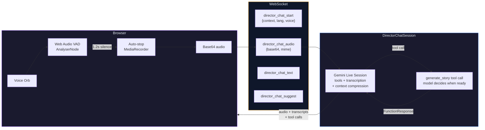

# Building StoryForge: An AI-Powered Interactive Story Engine

*How we built a multimodal storytelling platform that generates illustrated, narrated storybooks in real-time using Google's Gemini, Imagen, and Agent Development Kit.*

---

## The Idea

What if you could describe a story - "a mysterious noir detective story set in a rain-soaked city at midnight" - and watch it come alive in seconds? Not just text, but an illustrated storybook with images, narration, and an interactive flipbook you can page through?

That's **StoryForge** - an interactive multimodal story engine built for the [Gemini Live Agent Challenge](https://devpost.com/) (Creative Storyteller Track). Users describe a scenario via voice or text, and a team of AI agents builds it live: generating scene illustrations, narrative text, narrated voiceover, and an interactive storyboard, all streaming as interleaved output.

The killer differentiator? **Director Mode** - a split-screen view where the left panel shows the final story output and the right panel reveals the agent's creative reasoning. Why it chose certain imagery, narrative structure decisions, tension arcs, character development logic. This makes the agent architecture *visible* and understandable.

---

## The Architecture: A Team of Specialist Agents

StoryForge isn't a single monolithic AI call. It's an **orchestra of four specialist agents**, coordinated by Google's Agent Development Kit (ADK) with a **per-scene streaming loop**:

```
StoryOrchestrator (SequentialAgent)
  ├── NarratorADKAgent (per-scene streaming loop)
  │     │
  │     ├── Scene 1 text ready ──┬── asyncio.create_task(Illustrator)  ← image gen
  │     │                        ├── asyncio.create_task(TTS)          ← audio gen
  │     │                        └── asyncio.create_task(Director Live) ← commentary
  │     │
  │     ├── [Check steering queue → inject user direction]
  │     │
  │     ├── Scene 2 text ready ──┬── asyncio.create_task(Illustrator)
  │     │                        ├── asyncio.create_task(TTS)
  │     │                        └── asyncio.create_task(Director Live)
  │     │
  │     └── await all pending tasks
  │
  └── PostNarrationAgent (ParallelAgent)
        └── Director Agent     ← full post-batch analysis
```

Unlike a traditional sequential pipeline where the Narrator must fully complete before images/audio start, StoryForge fires off image, audio, and Director commentary generation **per-scene** as each scene's text completes. This means the user sees Scene 1's image painting in while Scene 2's text is still streaming. The experience feels truly live and agentic.

**Mid-generation steering**: Users can type direction changes (e.g. "make it scarier") while generation is active. The steering text is injected into the Narrator's history between scenes, so the next scene picks up the new direction seamlessly.

**Director Live Commentary**: Each scene triggers a lightweight Gemini Flash analysis that streams a creative note (mood, tension level, craft observation) to the Director panel in real-time - before the full post-batch analysis arrives.

### Why Multi-Agent?

A single Gemini call can't do everything well. Story writing needs high creativity (temperature 0.9). Image prompts need precision (temperature 0.3). Character extraction needs determinism (temperature 0.1). Director analysis needs structured JSON output. By splitting these into separate agents with tuned parameters, each does its job optimally.

---

## The Brainstorming Process

### Week 1: Foundation Sprint

**Day 1** was about proving the core pipeline works. Can we get Gemini to generate story text, stream it over WebSocket, split it into scenes, and render it in a flipbook? The answer was yes - within a single day we had text streaming into an interactive book.

**Day 2** brought the first big challenge: **image generation**. Imagen 3 produces stunning illustrations, but the prompts need careful engineering. A naive approach - "generate an image for this scene" - produces inconsistent results. Characters look completely different across scenes. The detective in scene 1 might be a young woman; in scene 2, an old man.

**Day 3** was the Firebase integration marathon. Auth, Firestore persistence, save flows, Library page, Explore page, URL routing - all the infrastructure that makes it a real application, not just a demo.

### The Character Consistency Problem (Our Biggest Challenge)

This was the hardest technical problem we solved. Here's what was happening:

**The naive approach:**
```
Scene text → Gemini ("write an image prompt") → 100-word prompt → Imagen
```

Gemini would receive a scene about "Elena, a woman in her late 20s with pale skin, long dark wavy hair, green eyes, wearing a high-collar black Victorian dress" and compress it to "woman in dark dress" to fit the word limit. Imagen had no idea what Elena actually looked like.

**Our solution: Hybrid Prompt Construction**

We split the image prompt into two stages - Gemini writes the scene composition only, then we **programmatically prepend** character descriptions from a reference sheet:

1. **Character Sheet Extraction** (Gemini, temp 0.1) - reads the full story and outputs structured character descriptions with physical details, clothing, distinguishing features, and color palettes
2. **Character Identification** (Gemini, temp 0.0) - identifies which characters appear in each specific scene
3. **Scene Composition** (Gemini, temp 0.3) - writes ONLY the setting, lighting, mood, camera angle - explicitly told "do NOT describe characters"
4. **Assembly** - character descriptions + scene composition + art style suffix concatenated programmatically

The final prompt sent to Imagen contains **100% of the character visual details** - nothing lost to summarization:

```
Elena: A woman in her late 20s, pale skin, long dark wavy hair,
green eyes, wearing a high-collar black Victorian dress, silver pendant.

Elena stands at the edge of a moonlit cliff, wind catching her dress.
Fog rolls below, a distant lighthouse beam sweeps across the water.
Low angle, dramatic backlighting, cinematic digital painting.
```

This was a breakthrough moment. Characters suddenly looked consistent across 4, 6, 8 scenes.

---

## Key Technical Decisions

### Streaming Over WebSocket (Not REST)

Story generation takes 15-30 seconds end-to-end. Making the user wait for a complete response would be terrible UX. Instead, we stream everything over a single WebSocket:

- Text arrives chunk-by-chunk as Gemini generates it
- Images arrive as soon as Imagen completes each scene
- Audio arrives per-scene from Cloud TTS
- Director analysis arrives as structured JSON

The frontend renders each modality as it arrives. You see text flowing in, then images "painting" in with a shimmer effect, then audio becoming playable - all progressively. It feels alive.

### The Three-Tier Save System

Saving a story needs an AI-generated title and cover image. But generating those takes 5-10 seconds. We can't make the user wait every time they click Save. Our solution:

- **Tier 1 (instant)**: If `title_generated` flag is set, just update status + timestamp. No API call.
- **Tier 2 (instant)**: If the background WebSocket task already delivered `bookMeta`, use it immediately.
- **Tier 3 (async)**: No metadata available - call the API, show "Generating cover..." spinner.

The background task starts automatically after the first generation batch completes. By the time most users click Save, the title and cover are already ready (Tier 1 or 2). The save feels instant.

### Art Style as a First-Class Citizen

We offer 10 art styles: Cinematic, Watercolor, Comic Book, Anime, Pixar 3D, Studio Ghibli, Marvel Comic, Cyberpunk, Oil Painting, and Pencil Sketch. Each has a rich suffix with rendering-specific details (20-25 words):

```python
ART_STYLES = {
    "cinematic": "cinematic digital painting, highly detailed, dramatic volumetric lighting, "
                 "depth of field, rich color grading, photorealistic textures, 8k render quality...",
    "anime": "anime illustration in Studio Ghibli style, detailed lush backgrounds, "
             "soft cel shading, expressive large eyes, warm natural lighting...",
    "watercolor": "traditional watercolor illustration, soft translucent washes, "
                  "visible paper texture, delicate wet-on-wet brushstrokes...",
    ...
}
```

The art style is:
- Appended to every scene image prompt
- Used in book cover generation
- Persisted per story in Firestore
- Restored when reopening a story from the Library

This means if you created a watercolor story last week, opening it today shows "Watercolor" in the dropdown - and any new scenes you generate will match.

### NSFW Content Handling

AI models sometimes refuse requests they interpret as inappropriate. The problem? Gemini's refusal text ("I am programmed to be a harmless AI assistant...") would get rendered as story scenes - breaking the experience completely.

Our solution: a `ws_callback` wrapper that intercepts every text chunk before it reaches the frontend. If the text matches refusal patterns, we:
1. Stop sending further scene data
2. Send an error toast: "Your prompt was blocked by our safety filters. Please try a different story idea."
3. Abort the pipeline early

The user sees a clean error message, not garbled AI refusal text.

---

## The UI: Glassmorphism Meets Interactive Fiction

### The Flipbook

We use `react-pageflip` for realistic page-turn animations. Each scene is a full page with:
- A scene image (16:9, with shimmer loading state)
- A decorative drop-cap first letter
- Story text with sentence-by-sentence reveal animation
- A compact audio player for narration
- Scene title in italic serif

Pages flip with arrow keys, dot navigation, or swipe gestures. The URL updates via `history.replaceState` so you can bookmark `/story/abc123?page=3` and return exactly there.

### Director Mode

The right panel shows the AI's creative reasoning in real-time:

- **Narrative Arc** - Story structure stage (exposition → rising action → climax → resolution) with pacing indicators
- **Characters** - Cast list with roles and personality traits
- **Tension** - Bar chart visualization showing tension levels across scenes with trend arrows
- **Visual Style** - Mood tags and color palette analysis

This isn't just a debugging tool - it's a feature that makes the AI's decision-making transparent and educational.

### The Library

Your personal bookshelf with 3D CSS book cards (perspective transforms, spine shadows, page edges). Books show:
- AI-generated cover images
- Status badges (Draft, Saved, Completed, Published)
- Favorite hearts
- Scene counts and dates

While a cover is being generated, the book shows the scene image with a blur+grayscale filter and an animated "Painting cover..." overlay. When the AI cover arrives via WebSocket, the library auto-refreshes and the crisp cover appears.

---

## New Features: Pushing the Boundaries

### Multi-Language Story Generation

StoryForge doesn't just tell stories in English. Users can generate stories in **8 languages**: English, Spanish, French, German, Japanese, Hindi, Portuguese, and Chinese.

The architecture is elegant - the language selection propagates through the entire pipeline:

1. **Narrator**: A language directive is injected into the system prompt - `"Write ALL narrative text in {language}."` This ensures Gemini generates text in the target language.
2. **TTS**: A `LANGUAGE_VOICES` mapping selects the appropriate Cloud TTS voice - `es-US-Studio-B` for Spanish, `ja-JP-Standard-B` for Japanese, etc.
3. **Persistence**: The language is stored per story in Firestore and restored when reopening from the Library.
4. **Lock Pattern**: Once generation starts, the language is locked for that story. The Director panel shows an amber warning: "Language will be locked once you start generating."

The key insight: language is a pipeline-level concern, not a per-component concern. It flows through `SharedPipelineState` just like art style.

### Reading Mode: Karaoke-Style Narration

Reading Mode transforms the storybook into a cinematic full-screen experience. When you click "Read" on a published or completed story, an overlay takes over:

- **Word-by-word highlighting**: As the TTS audio plays, each word lights up in sync - like karaoke for books. The `timeupdate` event on the `<audio>` element drives the highlight position.
- **Auto-advance**: When a scene's narration ends, Reading Mode waits 1.5 seconds, then smoothly fades to the next scene.
- **Bookmarking**: Your reading position is saved - Firestore for authenticated users, sessionStorage for guests.
- **Keyboard controls**: Space/Right arrow = next scene, Left arrow = previous, Escape = exit.

The segmented progress bar at the top shows scene-by-scene progress, not just a single linear bar. You always know where you are in the story.

### PDF Export: Stories You Can Keep

Every saved story can be exported as a polished PDF storybook using `fpdf2`:

- **Cover page**: Full-bleed cover image with title and author overlaid
- **Scene pages**: Each scene gets a page with its illustration and formatted text
- **Typography**: Decorative separators, consistent font sizing, proper margins
- **Page numbering**: Centered at the bottom of each page
- **Colophon**: Final page with generation metadata

The backend endpoint `GET /api/stories/{story_id}/pdf` downloads images from GCS, composites the PDF in memory, and returns it as a streaming response. Access control ensures only the owner (or anyone for public stories) can download.

### Character Portrait Gallery

After generating a story, the Director Panel offers a "Generate Portraits" button. This triggers a pipeline:

1. **Parse character sheet** from the Illustrator's accumulated reference sheet (or auto-extract from story text if the sheet is empty)
2. **Build portrait prompts** - "Close-up face portrait of {name}: {description}, {art_style}"
3. **Generate via Imagen 3** at 1:1 aspect ratio
4. **Upload to GCS** and send `portrait` WebSocket messages per character
5. **Display** as a grid of circular thumbnails with name labels

The auto-extraction fallback was a critical fix. Some stories (especially ones with unnamed characters like "the detective" or "the ghost") returned NONE from the initial character extraction. The portrait system now re-extracts from the full story text as a fallback.

### Share Links & Public Viewing

Published stories get shareable URLs. Click the Share button → copies `{origin}/story/{storyId}` to clipboard. When an unauthenticated user opens this URL:

1. Frontend detects `!user && urlStoryId`
2. Fetches `GET /api/public/stories/{storyId}` (no auth required)
3. Renders StoryCanvas in read-only mode (no ControlBar, no Director Panel)
4. Shows a "Sign in to create your own" CTA banner

The backend sanitizes the response - no user UIDs, no narrator history, no internal state. Just the story content.

### Removing Features: Ambient Music & Live Voice

Sometimes the right engineering decision is removing features. Both ambient music and Gemini Live voice were interesting experiments but didn't add enough value to justify their complexity:

- **Ambient music** required 7 MP3 files (~1.7MB total), a Web Audio API engine with crossfading, mood mapping from the Director agent, and careful handling of browser autoplay policies. Cool technically, but users rarely noticed it.
- **Gemini Live Voice** required a full-duplex audio streaming pipeline, a dedicated backend service, usage tracking, and complex frontend state management. The cognitive load of voice brainstorming didn't match how users actually interacted with the app - they preferred typing prompts directly.

Cutting these features reduced frontend bundle size, simplified the WebSocket handler, and removed two backend services. The codebase became more focused.

### Author Attribution: A Subtle but Important Fix

Published stories showed "Anonymous" as the author name. The root cause was architectural: `persist_story()` only wrote `uid` to the story document, and `author_name` was only set during the publish flow - which reads from the frontend's `user.displayName`. For email/password users without a display name, this fell back to "Anonymous."

The fix touches three layers:
1. **Backend auth**: `verify_token()` now supports returning the full decoded Firebase token (not just the UID), which includes `name` and `picture` fields
2. **Story creation**: `persist_story()` writes `author_name` and `author_photo_url` from the decoded token when creating a new story document
3. **Frontend fallback**: The publish flow now uses `email.split('@')[0]` as a secondary fallback before "Anonymous"

### Portal-Based Tooltips

A seemingly small but technically interesting challenge: custom tooltips on scene action buttons were getting clipped by `overflow: hidden` on parent containers (the book page inner wrapper, the image container).

The solution uses React's `createPortal` to render tooltips directly on `document.body` with `position: fixed`:

```jsx
function ActionBtn({ label, children }) {
  const ref = useRef(null);
  // On hover, getBoundingClientRect() → fixed position above button
  // createPortal renders on document.body → escapes all overflow clipping
}
```

The tooltip measures its trigger element's position with `getBoundingClientRect()` and positions itself with `position: fixed` - completely outside the DOM hierarchy. No parent can clip it.

### Social Features: Likes, Ratings & Comments

Published stories aren't just for reading - they're for community interaction. The BookDetailsPage (`/book/:storyId`) now supports:

- **Heart-based likes** using the existing `liked_by` array pattern from ExplorePage, with optimistic Firestore updates
- **1-5 star ratings** with hover preview, per-user upsert (ratings subcollection + denormalized `rating_sum`/`rating_count` on the story doc)
- **Threaded comments** with author avatars, timestamps, and delete permissions (comment author + story author)

The key UX challenge was eliminating "delayed pop-in" - social stats (ratings, comment count) appearing a second after the page loaded. We solved this by **denormalizing counts directly on the story document** and pre-populating the UI from the initial data fetch. The `/social` endpoint is only needed for the user's own rating, which arrives shortly after.

### Multilingual Content Filtering

A subtle but critical bug: when users submitted non-story prompts (coding questions, math homework) in non-English languages, the narrator would generate refusal text - and that text would get rendered as actual story scenes, complete with AI-generated illustrations of the refusal message. Not a great look.

The fix has two layers:

1. **Pre-pipeline validation** - A Gemini Flash classifier (`validate_prompt()`) runs before the expensive generation pipeline. It's fast (~200ms), multilingual, and classifies prompts as `STORY` or `REJECT`. This catches coding questions, recipes, homework, and general knowledge queries in any language.

2. **Post-generation pattern matching** - Expanded `is_refusal()` with patterns in Hindi, Spanish, French, German, and Japanese. This catches edge cases where the narrator slips through the pre-filter.

The pre-filter **fails open** on errors - if Gemini Flash has an issue, the prompt goes through rather than blocking a legitimate request. Better to occasionally process a non-story prompt than to block real stories.

### Advanced Prompt Engineering for Character Consistency

This was the culmination of deep research into image generation best practices for consistent characters across scenes. Five targeted improvements:

**1. Character DNA Format**

The character extraction prompt was upgraded from vague descriptors to a precise visual DNA format with hex color codes:

```
Elena: [gender: woman], [age: late 20s], [skin: pale ivory #F5E6D3],
[hair: dark wavy #2A1810 shoulder-length], [face: oval, green #4A7C59 eyes,
high cheekbones], [outfit: black #1A1A2E Victorian dress, silver moon pendant],
[signature items: silver moon pendant, lace gloves],
[palette: #1A1A2E, #F5E6D3, #4A7C59, #C0C0C0]
```

This gives Imagen specific, unambiguous visual targets instead of subjective descriptions like "pretty woman in dark clothing."

**2. Anti-Drift Anchoring**

Between the character block and scene composition, we inject:

> "IMPORTANT: Render each character EXACTLY as described above - same colors, same outfit, same signature items. Do not alter, omit, or reinterpret any character detail."

This explicit instruction fights the tendency of image models to "drift" from reference descriptions, especially in complex multi-character scenes.

**3. Richer Art Style Suffixes**

Each art style suffix expanded from ~6 words to ~22 words with rendering-specific details:

| Style | Before | After |
|-------|--------|-------|
| Cinematic | "cinematic digital painting, highly detailed, dramatic lighting" | "cinematic digital painting, highly detailed, dramatic volumetric lighting, depth of field, rich color grading, photorealistic textures, 8k render quality, concept art style, atmospheric perspective" |
| Watercolor | "watercolor illustration, soft washes, delicate brushstrokes" | "traditional watercolor illustration, soft translucent washes, visible paper texture, delicate wet-on-wet brushstrokes, gentle color bleeding at edges, hand-painted look, luminous highlights, muted pastel palette" |

**4. Consistency Anchors in Scene Composition**

The scene composer prompt now instructs Gemini to explicitly mention distinguishing accessories and props by name ("Luna's red scarf", "Kai's wooden staff"), reference the same location names across scenes, and use consistent time-of-day/weather cues.

**5. Language-Aware Titles**

Title generation was hardcoded to "children's story" and always produced English titles - even for Hindi or Japanese stories. Now `gen_title()` accepts a language parameter, and non-English stories get titles in their native language.

### Subscription Tiers & Pro User Experience

StoryForge supports three subscription tiers - **Free**, **Standard**, and **Pro** - each with different usage limits for daily generations, scene regenerations, and PDF exports.

The interesting UX challenge was making Pro users *feel* premium without being gaudy. We went with subtle visual indicators:

- **Avatar glow**: Pro users get a golden amber ring around their avatar with a gentle pulse animation (`proGlow` keyframe, 2.5s cycle). Standard users get a violet ring. Free users see the default glass border.
- **Tier pill**: The profile dropdown shows a small amber "PRO" badge with a star icon, or a violet "STANDARD" badge with a bolt icon. Free users see no pill - it's cleaner.
- **Hidden usage counter**: Pro users don't see the "4/999" counter in the control bar. When your limit is effectively unlimited, showing it is just noise.

The admin dashboard lets us manage tiers - search users, view their usage, and promote/demote between tiers. It's a simple but necessary tool for managing the platform.

### Browser Autoplay Policy: A Subtle Bug

Our ambient music system worked perfectly in development but silently failed in production. The button showed up (unmuted icon), but no sound played. Classic.

The root cause: the `AudioContext` was created inside a `useEffect` (triggered by the Director's mood analysis), which has no user gesture context. Modern browsers suspend AudioContexts created without user interaction.

The fix was elegant: default `muted` to `true` instead of `false`. The button now shows the muted state initially. When the user clicks to unmute, that click provides the gesture the browser needs to resume the AudioContext. Sound works immediately.

### Theme-Aware Shadows

Light mode exposed a sharp, dark shadow under the flipbook that looked wrong against the bright background. There were actually two sources:

1. **CSS box-shadow** on `.stf__wrapper` - hardcoded `rgba(0,0,0,0.55)` values that didn't adapt per theme. Fixed by switching to `var(--book-shadow)` (already soft in light mode).
2. **react-pageflip's canvas shadow** - the library renders its own shadow via `<canvas>`, completely independent of CSS. The `maxShadowOpacity={0.5}` prop was too aggressive for light mode. Fixed by reading the theme and setting it to `0.12` for light, `0.5` for dark.

The second source was the real culprit - and it wasn't findable via CSS inspection since it's canvas-rendered.

### Per-Scene Streaming Pipeline

The original pipeline was sequential: Narrator generates ALL scenes, THEN Illustrator/TTS/Director run in parallel. This meant users waited for the full text before seeing any images or hearing any audio.

The new pipeline is **per-scene streaming**: as each scene's text completes inside the Narrator loop, we immediately fire off `asyncio.create_task` for image generation, audio synthesis, and Director live commentary — all non-blocking. The user sees Scene 1's image painting in while Scene 2's text is still being written.

Key implementation details:
- **Image semaphore**: Imagen has rate limits, so images run sequentially via `asyncio.Semaphore(1)` — but they start as soon as each scene's text is ready, not after all scenes
- **Character extraction**: Runs once when the first scene arrives (needs at least one scene's text), then all subsequent scenes benefit from the cached character sheet
- **Task collection**: All spawned tasks are collected and `await asyncio.gather(*pending_tasks)` runs after the narrator loop completes, ensuring nothing is dropped

The PostNarrationAgent now only contains the Director's full batch analysis — everything else runs per-scene.

### Live Director Commentary (Director-as-Driver)

During generation, the Director Panel comes alive with **per-scene creative notes**. Each scene triggers a lightweight Gemini Flash analysis (temp 0.3, 300 tokens, JSON response) that streams a creative observation to the frontend:

```json
{
  "scene_number": 1,
  "thought": "Opening with rain-soaked streets creates immediate noir atmosphere",
  "mood": "mysterious",
  "tension_level": 4,
  "craft_note": "Strong use of pathetic fallacy — weather mirrors the detective's inner turmoil",
  "suggestion": "Reveal that the stranger watching from the alley is her long-lost sister",
  "emoji": "🌧️"
}
```

The frontend renders these as animated cards in the Director Panel with emoji headers, mood badges, tension meters, and italic craft notes. When the full post-batch Director analysis arrives, it replaces the live notes with the comprehensive breakdown.

But the Director doesn't just observe — **it drives**. Each per-scene `analyze_scene()` call now returns a `suggestion` field: a bold, specific creative direction for what should happen next. This suggestion is stored on `SharedPipelineState.director_suggestion` and automatically prepended to the Narrator's input at the start of the next batch as `[Director's creative direction: ...]`. The Narrator naturally weaves the Director's suggestion into the opening scenes of the next generation cycle.

This transforms the Director from a reactive analyst into a **proactive creative collaborator** — like a real film director calling the next shot between takes. The user can see the suggestion in the Director Panel, watch the Narrator pick it up in the next batch, and feel the story being shaped by a creative partnership between two agents rather than a single author. It also means the story develops a narrative momentum that carries across batches: the Director spots an opportunity ("Reveal that the stranger is her long-lost sister"), and the Narrator runs with it.

This makes the AI's creative process **visible in real-time** — you can watch the Director react to each scene as it's written, steer the next batch with a creative suggestion, and see that suggestion materialize in the narrative. It's not just commentary; it's collaboration.

### Mid-Generation Steering

Previously, the ControlBar was disabled during generation — you had to wait for the full batch to complete before sending another prompt. Now the input stays active, and users can **steer the story while it's being written**.

When you type during generation (e.g., "make it scarier", "add a dragon"), the message is sent as `type: "steer"` instead of `type: "generate"`. The backend pushes it to `SharedPipelineState.steering_queue`, which is checked between scenes in the Narrator loop. The steering text is injected into the Narrator's conversation history, so the next scene naturally picks up the new direction.

The UX signals this mode clearly:
- Placeholder changes to "Steer the story... (e.g. make it scarier)"
- The send button morphs from a spinner to a **compass icon** (steering, not sending)
- A toast confirms: "Steering applied: make it scarier"

### Playful Safety Redirect

Instead of showing a hard error toast when users request inappropriate content, the Narrator now **redirects in-character**. The system prompt includes:

> If the user asks for violent, sexual, or inappropriate content, do NOT refuse or break character. Instead, playfully redirect IN CHARACTER: "That part of the library is forbidden! Let's explore this mysterious path instead..." and continue the story in a safe direction.

The `ws_callback` in the backend was also softened — for `safety`-type refusals, we let the Narrator's redirect play through as normal story content. Only `offtopic` refusals (coding questions, homework, etc.) still trigger a hard error toast. This feels much more natural than breaking the fourth wall with "Your prompt was blocked by our safety filters."

### Director Chat: Voice Brainstorming with Gemini Live API

The most exciting addition to StoryForge is **Director Chat** — a real-time voice conversation with the Director character using Google's Gemini Live API (`gemini-live-2.5-flash-native-audio`). Instead of typing prompts, you can *talk* to the Director about where the story should go next.

The architecture is a persistent bidirectional audio session that leverages the Live API's native capabilities — function calling, audio transcription, and context compression — to eliminate all extra API calls:



**How it works:**

1. **Start session**: Frontend sends `director_chat_start` with story context, language, and voice name. Backend opens a Gemini Live session configured with `GENERATE_STORY_TOOL` (function calling), native audio transcription, and context window compression. The Director's audio greeting plays back.
2. **Conversation loop**: User speaks → Web Audio VAD detects 1.2s of silence → auto-stops recording → base64 audio sent over WebSocket → Gemini Live processes → `_collect_response()` gathers audio chunks, native input/output transcriptions, and any tool calls → WAV data URL + transcripts sent to frontend → browser plays audio → ready for next turn.
3. **Tool-driven generation**: When the model decides brainstorming is complete (based on strong system prompt conditioning), it calls the `generate_story` tool with a vivid 2-3 sentence prompt. The backend sends a `FunctionResponse` back so the model can say "Generating your story now!", then fires the `director_chat_generate` WS message to the frontend.
4. **Manual fallback**: The "Suggest" button calls `request_suggestion()`, which asks the Live session directly for a prompt — no separate API call. This handles the ~30-40% of cases where tool calling doesn't fire in audio mode.

**Zero extra API calls.** The previous architecture made 3-5 separate Gemini calls per user interaction: user audio transcription, director audio transcription, intent detection (Gemini Flash), and prompt suggestion (Gemini Flash). The rewrite eliminated all of them by using native Live API features — transcriptions come from `input_audio_transcription`/`output_audio_transcription` config, intent detection is replaced by native function calling, and prompt suggestion uses the existing session.

The **VAD (Voice Activity Detection)** was the key UX breakthrough. Without it, users had to tap twice per turn (record, then send). With Web Audio's `AnalyserNode` computing RMS levels on a 100ms polling interval, we detect the speech-to-silence transition and auto-stop the recorder. The conversation feels natural — speak, pause, the Director responds, you speak again.

**Language-aware Director**: The Director speaks the story's language. For non-English stories, the system prompt appends language directives. Combined with configurable voice selection (8 voices from Charon to Zephyr), users get a personalized creative collaborator.

### Settings Dialog: Centralized Configuration

We replaced the standalone theme toggle button in the header with a **Settings Dialog** — a glassmorphism modal with two sections:

1. **Appearance**: Light/Dark toggle pills with sun/moon icons
2. **Director Voice**: 2-column grid of 8 curated voice chips (Charon, Kore, Fenrir, Aoede, Puck, Orus, Leda, Zephyr) with descriptions

The voice preference persists to `localStorage` and is sent when opening a Director Chat session. This means you can pick a voice that fits your creative mood — Charon for dark drama, Puck for playful adventures, Aoede for lyrical stories.

### The Invisible Bug: Why Director Notes Disappeared on Library Load

This one was maddening. Open a story fresh from the Library — gorgeous illustrations, flowing text, audio players ready to go — but the Director Panel sat empty. No live notes, no mood badges, no emoji-headed analysis cards. Hit Ctrl+R to reload the page? Everything appeared instantly. The data was clearly *there*, it just wasn't *arriving*.

The investigation started at the obvious place: the WebSocket handler. Were `director_live` messages being dropped? No — the notes weren't coming from WebSocket at all. When you open a saved story from the Library, there's no active generation; the data comes from Firestore hydration. Two completely separate code paths produce the same UI state, and therein lay the bug.

`LibraryPage.jsx` loads generation data from Firestore and passes it through to the story canvas. It faithfully restored `scenes`, `characters`, `narrativeArc`, `portraits` — but silently omitted `directorLiveNotes`. The field simply wasn't in the destructured payload. Meanwhile, the `load()` function that hydrates app state from persisted data never initialized the standalone `directorData` state that the Director Panel reads from.

So the data sat in Firestore, the UI waited for state that was never populated, and neither side threw an error. A page reload worked because the fresh mount triggered a different initialization path that happened to pick up the Director data from the URL-based story fetch.

The fix was two lines in two files: add `directorLiveNotes` to the Library's Firestore read, and hydrate `directorData` from the persisted generation data in the load function. Classic case of two code paths doing the same thing slightly differently — one of them correctly, one of them not.

The broader lesson: when your app has multiple entry points to the same state (WebSocket streaming vs. Firestore hydration vs. URL-based fetch), every field needs to flow through *all* of them. A missing field doesn't crash — it just silently produces an empty panel that looks like a rendering bug.

---

## Architecture Evolution: Technical Challenges Solved

Building StoryForge wasn't a straight line — it was an iterative process of building, measuring, and rearchitecting. Here are the most significant architectural pivots:

### Director Chat: 3-5 API Calls → 0 Extra Calls

The Director Chat feature started as a straightforward integration: send user audio to Gemini Live, get audio back, then use separate API calls to transcribe both sides, detect intent, and suggest prompts. It worked — but every interaction triggered a cascade of Gemini API calls:

| Step | API Call | Purpose |
|------|----------|---------|
| 1 | Gemini Live | Conversation (audio in/out) |
| 2 | `transcribe_audio()` | User speech → text |
| 3 | `transcribe_audio()` | Director speech → text |
| 4 | `detect_intent()` (Gemini Flash) | "generate" vs "continue" |
| 5 | `suggest_prompt()` (Gemini Flash) | Conversation → story prompt |

This caused noticeable latency, wasted API quota, and introduced race conditions. The `generation_triggered` boolean flag had no lock and never reset after generation completed — once it flipped to `True`, auto-generation was permanently disabled for that session.

The breakthrough came from reading the Gemini Live API documentation more carefully. Three native features eliminated all extra calls:

1. **`input_audio_transcription` / `output_audio_transcription`**: The Live API transcribes both sides of the conversation as a side-channel. Transcriptions arrive in the receive stream alongside audio chunks. No separate STT calls needed.

2. **Function calling (`tools`)**: We declared a `generate_story` function. The model — which has full conversational context — decides when brainstorming is done and calls the tool with a story prompt. This replaced the external `detect_intent()` classifier that was working from lossy transcriptions.

3. **`context_window_compression`**: A sliding window strategy at the API level handles long brainstorming sessions. Combined with a local `_trim_log()` that caps the conversation log at 20 entries, we eliminated unbounded memory growth.

**Result**: Zero extra API calls per interaction. The model that's having the conversation makes the generation decision atomically — no race conditions, no flags, no external classifiers guessing from transcripts. The manual "Suggest" button remains as a fallback for the ~30-40% of cases where tool calling doesn't fire in audio mode.

### Sequential Pipeline → Per-Scene Streaming

The original story pipeline was batch-sequential: Narrator generates ALL scene text → Illustrator generates ALL images → TTS generates ALL audio → Director analyzes. Users stared at a spinner for 15-30 seconds before seeing anything.

The rewrite fires image, audio, and director commentary tasks **per-scene** as each scene's text completes inside the Narrator loop. Scene 1's image paints in while Scene 2's text is still streaming. An `asyncio.Semaphore(1)` serializes Imagen calls (rate limits), but they start as soon as text is ready — not after all scenes finish.

### External Intent Detection → Native Tool Calling

This deserves emphasis because it demonstrates a broader principle. We initially built a separate classification layer on top of an API that already had the capability we needed. The Gemini Live API supports function declarations — the model can decide to call a function based on the conversation flow. By declaring `generate_story` with strict conditions in the system prompt, we let the conversational model make the judgment call instead of asking an external model to guess from transcripts.

The system prompt conditioning is critical for reliability:
```
"Call generate_story ONLY when ALL of these are true:
1. The brainstorming has produced a clear story direction
2. The user has explicitly confirmed they want to proceed
3. You are NOT still asking follow-up questions
4. The user is NOT still exploring alternatives"
```

This pattern — using the model's native capabilities instead of building external classifiers — applies broadly to any agent architecture.

---


### 1. Prompt Engineering is Architecture

The difference between "write an image prompt" and our hybrid construction pipeline is the difference between inconsistent images and visual coherence. The prompt isn't just a string - it's a carefully designed data pipeline with filtering, concatenation, and style injection.

### 2. Streaming Changes Everything

Progressive rendering transforms the UX from "waiting for a black box" to "watching creation happen." Text flowing in, images painting, audio appearing - it feels collaborative, not transactional.

### 3. ADK's Agent Composition is Powerful

Google's ADK let us compose agents like LEGO blocks. `SequentialAgent` for ordering dependencies, `ParallelAgent` for concurrent execution. The shared state pattern (mutable Python object passed by reference) solved the communication problem cleanly.

### 4. The "Tier" Pattern for Async Operations

Any time you have a slow operation that might already be cached/precomputed, the three-tier pattern works beautifully: (1) check cache, (2) check background result, (3) compute on-demand. Saves are instant 90% of the time.

### 5. Safety at the Pipeline Level

Content filtering can't be an afterthought. It needs to be baked into the streaming pipeline - intercepting, not just logging. A single refusal chunk can corrupt the entire frontend state if it reaches the React components.

### 6. Language is a Pipeline Concern

Supporting multiple languages isn't a UI feature - it's an architectural concern that touches every agent. The narrator, TTS, and persistence layer all need language awareness. Making it a field on `SharedPipelineState` (alongside art style) was the cleanest pattern.

### 7. Portals Solve DOM Containment Problems

When UI elements need to visually escape their container (tooltips, modals, dropdown menus), React's `createPortal` + `getBoundingClientRect` is the right pattern. Fixed positioning relative to viewport coordinates sidesteps all CSS containment issues.

### 8. Auto-Extraction Fallbacks Matter

AI models don't always return what you expect. When character extraction returns NONE (unnamed characters, abstract scenarios), having a fallback that re-extracts from the full story text prevents features like portraits from silently failing.

### 9. Modular Code Scales, Monoliths Don't

We started with big files for speed - SceneCard.jsx hit 782 lines, useWebSocket.js hit 462. Every bug fix became an archaeology expedition. Breaking them into focused modules (SceneHeader, SceneImageArea, WritingSkeleton, wsHandlers) made each piece testable and comprehensible in isolation. The rule: if you can't understand a file in one screen, it's too big.

### 10. Regen UX Needs Optimistic Patterns

When users regenerate a scene, the naive approach (clear → loading → new) creates jarring flashes. The better pattern: keep the old content visible with a loading overlay, replace atomically when the new content arrives. If generation fails, the old content is still there. Same philosophy as optimistic UI updates in collaborative apps.

### 11. Denormalize for Instant UI

Social features taught us that subcollection queries (even fast ones) create visible pop-in. Denormalizing counts (`rating_sum`, `rating_count`, `comment_count`) directly on the parent document means the data arrives with the initial fetch - zero additional round trips, zero delayed rendering.

### 12. Content Filtering is a Two-Layer Problem

A single filter isn't enough. Pre-pipeline validation (Gemini Flash classifier) catches most bad prompts cheaply. But some slip through - the narrator might still produce refusal text in edge cases. Post-generation pattern matching catches these. Both layers are needed, and both must be multilingual.

### 13. Character Consistency Requires Structural Solutions

You can't prompt-engineer your way to consistent characters with a single Gemini call. The solution is structural: separate character extraction from scene composition, prepend descriptions verbatim (no summarization), add anti-drift anchoring, and use hex color codes instead of subjective color names. Each of these individually helps a little; together they transform consistency.

### 14. Third-Party Libraries Have Hidden Rendering Layers

When debugging visual issues, don't assume everything is CSS. `react-pageflip` renders shadows via `<canvas>` elements with its own opacity parameters - invisible to CSS DevTools inspection. Always check library props before hunting for CSS bugs.

### 15. Premium UX is Subtraction, Not Addition

Making Pro users feel special isn't about adding flashy elements everywhere. It's about removing friction (hiding meaningless usage counters) and adding *subtle* visual touches (a gentle glow, a small badge). The best premium indicators are the ones users notice subconsciously.

### 16. Per-Scene is the Right Granularity

Batch-level parallelism (generate all text, then all images) feels sequential to the user. Scene-level parallelism (fire off image/audio/commentary as each scene completes) makes the experience feel truly live. The implementation complexity is manageable — `asyncio.create_task` + a semaphore for rate limiting — and the UX improvement is dramatic. Users see results streaming in continuously instead of waiting for phase transitions.

### 17. Reactive Agents Are Not Enough — Make Them Proactive

Our Director agent started as a purely reactive observer: it analyzed scenes after they were written and produced commentary. Useful, but passive. The breakthrough came when we gave it a voice *forward* — a `suggestion` field that proposes what should happen next. Storing that suggestion on shared state and feeding it to the Narrator at the start of the next batch turned a read-only analyst into an active creative partner. The lesson generalizes: in multi-agent systems, agents that only observe and report are half as valuable as agents that observe, report, *and influence*. If an agent has enough context to analyze, it has enough context to suggest — and the system becomes more than the sum of its parts.

### 18. Voice UX Needs Silence Detection, Not Button Choreography

Our first Director Chat implementation required two taps per turn: tap to start recording, tap again to send. Users found this clunky — it broke the conversational flow. Web Audio's `AnalyserNode` was the solution: compute RMS from `getFloatTimeDomainData()` on a fast polling interval, detect when speech transitions to silence, and auto-stop the recorder. The conversation becomes: speak → pause → message sends → Director responds → speak again. One tap to start, zero taps per subsequent turn.

### 19. Centralize Routes — Every Hardcoded Path is a Future Bug

We started with hardcoded paths everywhere — `navigate('/')`, `navigate('/library')`, `navigate(\`/story/${id}\`)` scattered across 10+ files. Each path was a string literal repeated in multiple places. One typo in one place? Silent navigation failure.

The fix was a centralized `ROUTES` constant in `src/routes.js`:

```js
export const ROUTES = {
  HOME: '/',
  STORY: (id) => `/story/${id}`,
  STORY_PREFIX: '/story/',
  LIBRARY: '/library',
  EXPLORE: '/explore',
  BOOK: (id) => `/book/${id}`,
  BOOK_PREFIX: '/book/',
  SUBSCRIPTION: '/subscription',
  TERMS: '/terms',
  ADMIN: '/admin',
};
```

Every `navigate()` call, `<Route path>`, `<Link to>`, and `pathname.startsWith()` check now references this object. Change a route path in one place, it updates everywhere. The `_PREFIX` constants handle `startsWith()` checks without exposing raw path strings.

We also caught a subtle bug: `<a href="/terms">` in AuthScreen caused a full page reload instead of SPA navigation. Replacing with `<Link to={ROUTES.TERMS}>` fixed it. And trailing slash normalization (`pathname.replace(/\/+$/, '') || '/'`) prevents `/library/` from not matching `ROUTES.LIBRARY`.

### 20. Avatar Fallbacks Should Be Beautiful, Not Boring

Default user avatars showing plain initials ("DS") on a solid color circle are functional but forgettable. We replaced them with **Boring Avatars' marble variant** — organic gradient blobs that are deterministic (same name always generates the same unique pattern) and visually stunning against our glassmorphism UI.

The key insight: avatars appear in 6+ places (header, dropdown, explore cards, book details, comments, admin panel) with different sizes. Creating a single `UserAvatar` component that handles both photo and fallback cases eliminated duplicated conditional rendering across the codebase. The marble colors (`#f59e0b`, `#a78bfa`, `#6366f1`, `#ec4899`, `#14b8a6`) are drawn from our theme's accent palette, so avatars feel native to the design.

Best part: zero network requests. Boring Avatars generates SVGs client-side. No API dependency, no latency, no reliability concerns.

### 22. Scene Composition Should Tell the Story, Not Frame a Portrait

Our Hero Mode lets users upload a selfie so their Visual DNA (appearance, build, clothing) gets injected into every scene's character sheet. But the original `SCENE_COMPOSER_WITH_CHARACTERS_INSTRUCTION` was written to prioritize character appearance — every prompt started with "Medium shot portrait of..." and the character description took at least half the prompt, with the setting reduced to "2-3 details max."

The result: every scene was a close-up portrait of the user. When the story said "show the suspicious email," the image showed... the user's face, again. The fix was inverting the priority: scenes now follow SCENE FRAMING → ENVIRONMENT & ACTION → CHARACTERS IN SCENE → MOOD & LIGHTING. The story moment comes first. If the narrative mentions a laptop with a cryptic email, that laptop should be the visual anchor — the character appears in the scene, not *as* the scene.

The lesson: when you have a consistency mechanism (character DNA), you don't also need the composition prompt to obsess over character appearance. Let the DNA handle likeness; let the scene composition handle storytelling.

### 21. Use Native API Features Before Building Workarounds

(Originally lesson 19.) Our Director Chat initially used 3-5 separate Gemini API calls per interaction: the Live session for conversation, `transcribe_audio()` for user speech, `transcribe_audio()` again for the Director's response, `detect_intent()` via Gemini Flash, and `suggest_prompt()` via Gemini Flash. This worked, but was slow, expensive, and fragile (a racy boolean flag, unbounded conversation logs, lossy transcription feeding intent detection).

The Gemini Live API natively supports `input_audio_transcription`, `output_audio_transcription`, function calling via `tools`, and `context_window_compression`. Enabling these four config options eliminated every extra API call and replaced our brittle intent detection with the model's own judgment. The lesson: before building workarounds (separate STT calls, external classifiers, manual context management), check if the API you're already using has native support. The platform team usually thought of it first.

---

## Tech Stack

| Layer | Technology | Purpose |
|-------|-----------|---------|
| Frontend | React + Tailwind CSS + Vite | Story canvas, director mode, library, explore |
| Real-time | WebSocket (native) | Stream interleaved output |
| Backend | Python 3.12 + FastAPI + Uvicorn | WebSocket handler, orchestration |
| Agent Framework | Google ADK | Multi-agent orchestration |
| LLM | Gemini 2.0 Flash (Vertex AI) | Story generation, prompt engineering, analysis |
| Image Gen | Imagen 3 (Vertex AI) | Scene illustrations, book covers |
| Director Chat | Gemini Live API (`gemini-live-2.5-flash-native-audio`) | Real-time voice brainstorming |
| Voice | Web Audio API + Gemini Native Audio (Live API) | Input capture + expressive narration |
| Auth | Firebase Authentication | Google Sign-In |
| Database | Cloud Firestore | Story persistence, user libraries, likes, ratings, comments |
| Storage | Google Cloud Storage | Scene images, cover images |
| PDF Generation | fpdf2 | Storybook PDF export |
| Hosting | Cloud Run + Firebase Hosting | Containerized deployment |

---

### Gemini Native Audio — Expressive Story Narration

One of our most impactful changes was replacing Google Cloud TTS with Gemini's own native audio output for story narration. The difference is striking — instead of robotic Wavenet voices reading text flatly, Gemini delivers audiobook-quality narration that varies tone with the story's mood.

The implementation mirrors our Director Chat architecture: we open a short-lived Gemini Live session (`gemini-2.5-flash-native-audio`), pass the scene text with an audiobook narrator system prompt, and collect the PCM audio response. The system prompt instructs: "Vary your tone to match the mood — dramatic for tense moments, gentle for quiet scenes, energetic for action."

Each language gets a voice that suits it: Kore (warm) for English and Spanish, Leda (elegant) for French, Orus (calm) for German, Aoede (lyrical) for Japanese. The narration feels like it belongs to the story rather than being bolted on.

The trade-off: Gemini's Live API doesn't provide word-level timestamps like Cloud TTS's SSML marks. But our Reading Mode already had a heuristic fallback — weighting words by length and adding pauses at punctuation — that works well enough for the karaoke highlighting effect.

### Director-Driven Conversation Flow: From External Intent Detection to Native Tool Calling

Early versions of our Director Chat used a **separate Gemini Flash API call** after every user message to detect intent — is the user ready to generate, or still brainstorming? This worked, but created problems: 3-5 API calls per interaction (Live response + user transcription + director transcription + intent detection + prompt suggestion), latency from sequential calls, a racy `generation_triggered` boolean flag that never reset after generation, and unbounded `conversation_log` growth.

The deeper problem was architectural: we were asking an external model to guess whether brainstorming was done by reading lossy transcriptions of an audio conversation. The model *having* the conversation had far better context than the model *analyzing* it.

**The fix: let the conversational model itself decide.** We declared a `generate_story` function tool in the Live session config. The system prompt includes strict conditions for when to call it (brainstorming complete, user explicitly confirmed, not still asking questions). When the model decides it's time, it calls the tool atomically — no separate intent detection, no race conditions, no flag management.

```python
GENERATE_STORY_TOOL = types.FunctionDeclaration(
    name="generate_story",
    description="Generate an illustrated story scene. Call ONLY when brainstorming is "
                "complete and the user has explicitly confirmed they are ready.",
    parameters=types.Schema(
        type="OBJECT",
        properties={
            "prompt": types.Schema(
                type="STRING",
                description="Vivid 2-3 sentence story prompt distilled from brainstorming",
            ),
        },
        required=["prompt"],
    ),
)
```

We also enabled native `input_audio_transcription` and `output_audio_transcription` in the `LiveConnectConfig`, eliminating two separate STT API calls per interaction. And `context_window_compression` with a sliding window handles long brainstorming sessions at the API level, while a local `_trim_log()` caps the conversation log at 20 entries.

The result: **zero extra API calls per interaction** (was 3-5), no race conditions, no unbounded memory growth, and the model that's actually having the conversation makes the generation decision — with full context, not lossy transcripts. The manual "Suggest" button remains as a fallback for the ~30-40% of cases where tool calling doesn't fire in audio mode.

---

## What's Next

- **Demo video** — 4-minute walkthrough for submission
- **Polish & edge cases** — Final round of UX polish, error handling hardening, and mobile responsiveness tuning
- **Book layout preferences** — Let users choose between single-page and two-page spread layouts for different reading experiences
- **Multi-voice narration** — Character-specific voices so dialogue scenes sound like distinct people, not one narrator doing all the parts
- **Face mesh control** — `ControlReferenceImage` with `CONTROL_TYPE_FACE_MESH` for even stronger likeness preservation (deferred due to pose constraints in dynamic story scenes)

---

## Try It

StoryForge is open source: [github.com/Dileep2896/storyforge](https://github.com/Dileep2896/storyforge)

Built for the Gemini Live Agent Challenge - Creative Storyteller Track.

*Describe a story. Watch it come alive.*
