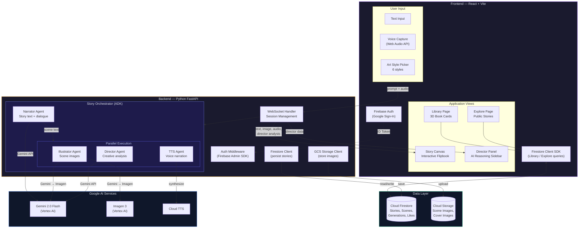
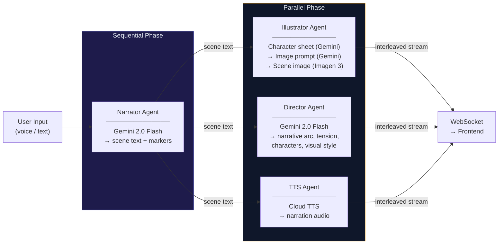

# StoryForge

**An interactive multimodal story engine powered by Google Gemini**

StoryForge is an interactive multimodal story engine. Users describe a scenario via voice or text — a mystery, a children's bedtime story, a historical event — and the agent builds it live. It generates scene illustrations, narrative text, narrated voiceover, and an interactive storyboard, all streaming as interleaved output. Users can interrupt and steer the narrative in real-time ("make the villain scarier," "add a plot twist"), and the story dynamically reshapes.

**Killer Feature — Director Mode:** A split-screen view where the left panel shows the final story output and the right panel reveals the agent's creative reasoning — why it chose certain imagery, narrative structure decisions, tension arcs, and character development logic. This makes the agent architecture *visible* to judges.

Built for the [Gemini Live Agent Challenge](https://devpost.com/) (Creative Storyteller Track).

---

## Features

- **Multimodal Storytelling** — Text, images, and audio stream together in real-time as an interactive flipbook
- **Voice Input** — Hold-to-talk voice capture using Web Audio API for hands-free story steering
- **Audio Narration** — Google Cloud Text-to-Speech narrates each scene with distinct character voices
- **Art Style Selection** — Choose from 6 visual styles: Cinematic, Watercolor, Comic Book, Anime, Oil Painting, Pencil Sketch
- **Genre Quick-Start** — Click a genre pill (Mystery, Fantasy, Sci-Fi, Horror, Children's) to populate a starter prompt
- **Story Continuation & Steering** — Send follow-up prompts to continue, redirect, or reshape the story mid-flow
- **Director Mode** — A sidebar panel revealing the agent's creative reasoning: narrative structure, tension arcs, character development, and visual decisions
- **Tension Arc Visualization** — Live graph showing narrative tension across scenes
- **Interactive Flipbook** — Pages flip with realistic animation, keyboard navigation (arrow keys), and dot-based page navigation
- **Character Consistency** — Illustrator extracts a character sheet from the full story to maintain visual consistency across scenes
- **Firebase Auth** — Google Sign-In for user accounts
- **Story Persistence** — Cloud Firestore saves stories, scenes, and generations with AI-generated titles and cover images
- **Library** — Personal bookshelf with 3D CSS book cards, favorites (heart toggle), status filters (All/Favorites/Saved/Completed), search, and sort (Recent/Title)
- **Explore** — Browse publicly published stories with likes, liked filter, search, and sort (Recent/Title/Author)
- **Save & Complete Flow** — Save stories to Library, mark as Complete (locks editing), publish to Explore for others to read
- **Completed Book Protection** — Completed books are read-only regardless of entry point (Library or Explore)
- **URL Routing** — Deep-linkable story URLs (`/story/:id?page=N`) with auto-resume on page reload
- **Image Error Handling** — Graceful fallbacks with specific user messages for quota, safety filter, timeout errors
- **Glassmorphism UI** — Frosted glass panels with dark/light theme support
- **New Story** — Start fresh at any time with the New Story button — resets both frontend and backend state

---

## System Architecture



---

## Cloud Infrastructure


---

## Agent Architecture (ADK)

StoryForge uses Google's ADK to orchestrate three specialized agents:

### 1. Narrator Agent
- **Role:** Story writer — generates narrative text, dialogue, scene descriptions
- **Input:** User prompt + story state + steering commands
- **Output:** Structured story beats with `[SCENE]` markers
- **Model:** Gemini 2.0 Flash via Vertex AI

### 2. Illustrator Agent
- **Role:** Visual creator — generates scene illustrations
- **Pipeline:** Character sheet extraction (Gemini) → Image prompt engineering (Gemini) → Image generation (Imagen 3)
- **Key behavior:** Maintains visual consistency across scenes by accumulating story text and merging character sheets across batches

### 3. Director Agent
- **Role:** Meta-analyst — explains the creative process in real-time
- **Output:** Structured JSON with narrative arc, characters, tension levels, and visual style analysis
- **Model:** Gemini 2.0 Flash
- **Key behavior:** Provides glanceable visual summaries (stage pills, tension bars, mood tags) with expandable detail text

### Orchestration Flow



---

## Interleaved Output Strategy

The output *weaves* modalities together, not just appends them sequentially:

```
[TEXT]      "The detective pushed open the creaking door..."
[IMAGE]    → generated: dimly lit doorway, noir style
[AUDIO]    → narration of the text with gravelly voice
[DIRECTOR] → "Opening with sensory detail (sound) to build tension. Noir palette chosen to match mystery genre."

[TEXT]      "Inside, the room was chaos — papers scattered, a chair overturned..."
[IMAGE]    → generated: ransacked office interior
[AUDIO]    → narration continues, tone shifts to urgency
[DIRECTOR] → "Escalating visual disorder signals rising stakes. No body yet — withholding the payoff."
```

---

## Tech Stack

| Layer | Technology | Purpose |
|-------|-----------|---------|
| Frontend | React + Tailwind CSS + Vite | Story canvas, director mode, library, explore |
| Auth | Firebase Authentication | Google Sign-In for user accounts |
| Voice Input | Web Audio API + MediaRecorder | Capture user voice for steering |
| Real-time Comms | WebSocket (native) | Stream interleaved output to client |
| Backend | Python 3.12 + FastAPI + Uvicorn | WebSocket handler, orchestration |
| Agent Framework | Google ADK (Agent Development Kit) | Multi-agent orchestration |
| LLM | Gemini 2.0 Flash (Live API) | Story generation, interleaved output |
| Image Gen | Imagen 3 (via Vertex AI) | Scene illustrations, character portraits |
| Voice Output | Google Cloud Text-to-Speech | Story narration with distinct voices |
| Database | Cloud Firestore | Story persistence, user libraries, likes |
| Hosting | Google Cloud Run | Containerized backend deployment |
| Static Hosting | Firebase Hosting | Frontend SPA |
| Container | Docker | Reproducible builds |

---

## Project Structure

```
storyforge/
├── frontend/
│   ├── src/
│   │   ├── App.jsx                    # Main app — routing, header, save/complete/publish flows
│   │   ├── firebase.js                # Firebase config and Firestore exports
│   │   ├── components/
│   │   │   ├── Logo.jsx + Logo.css    # Animated StoryForge logo
│   │   │   ├── StoryCanvas.jsx        # Flipbook with page-turn animation
│   │   │   ├── SceneCard.jsx          # Scene: image + text + audio with drop cap
│   │   │   ├── BookNavigation.jsx     # Dot navigation + arrow controls
│   │   │   ├── DirectorPanel.jsx      # Director reasoning sidebar
│   │   │   ├── ControlBar.jsx         # Input + art style pills + voice
│   │   │   ├── LibraryPage.jsx        # User's book library with 3D cards
│   │   │   ├── ExplorePage.jsx        # Public story browser with likes
│   │   │   └── storybook.css          # Flipbook & page styles
│   │   ├── contexts/
│   │   │   └── ThemeContext.jsx        # Dark/light mode
│   │   ├── hooks/
│   │   │   ├── useWebSocket.js        # WebSocket connection + story load/resume
│   │   │   ├── useVoiceCapture.js     # Web Audio API hook
│   │   │   └── useAuth.js             # Firebase Auth hook (Google Sign-In)
│   │   ├── utils/
│   │   │   └── audioPlayer.js         # Queue and play TTS audio chunks
│   │   ├── theme.css                  # Centralized glassmorphism theme
│   │   └── index.css                  # Global styles
│   ├── Dockerfile
│   └── package.json
├── backend/
│   ├── main.py                        # FastAPI + WebSocket endpoint
│   ├── agents/
│   │   ├── orchestrator.py            # ADK root agent — coordinates all agents
│   │   ├── narrator.py                # Story text generation agent
│   │   ├── illustrator.py             # Image generation agent
│   │   └── director.py                # Creative reasoning agent
│   ├── services/
│   │   ├── gemini_client.py           # Gemini API wrapper (GenAI SDK)
│   │   ├── imagen_client.py           # Imagen 3 via Vertex AI
│   │   └── tts_client.py              # Cloud Text-to-Speech
│   ├── requirements.txt
│   └── Dockerfile
├── docker-compose.yml                 # Local dev environment
├── HISTORY.md                         # Detailed development history
└── README.md
```

---

## Quick Start

### Prerequisites

- Node.js 20+
- Python 3.12+
- Docker (optional, for containerized dev)
- Google Cloud account with Vertex AI, Cloud TTS, and Firestore APIs enabled

### 1. Clone & Install

```bash
git clone https://github.com/Dileep2896/storyforge.git
cd storyforge
```

### 2. Backend Setup

```bash
cd backend
python3 -m venv .venv
source .venv/bin/activate
pip install -r requirements.txt

# Configure environment
cp .env.example .env
# Edit .env with your API keys
```

### 3. Frontend Setup

```bash
cd frontend
npm install
```

### 4. Run Locally

```bash
# Terminal 1 (Backend)
cd backend && source .venv/bin/activate
uvicorn main:app --reload --port 8000

# Terminal 2 (Frontend)
cd frontend
npm run dev
```

Open **http://localhost:5173**, type a story prompt, and watch it generate live.

### 5. Run with Docker

```bash
docker compose up --build
```

---

## GCP Setup

```bash
# Authenticate
gcloud auth login
gcloud config set project storyforge-hackathon

# Enable required APIs
gcloud services enable \
  aiplatform.googleapis.com \
  run.googleapis.com \
  generativelanguage.googleapis.com \
  texttospeech.googleapis.com \
  firestore.googleapis.com

# Set application default credentials
gcloud auth application-default login
gcloud auth application-default set-quota-project storyforge-hackathon
```

---

## Environment Variables

```env
# Google Cloud
GOOGLE_CLOUD_PROJECT=storyforge-hackathon
GOOGLE_APPLICATION_CREDENTIALS=./credentials.json

# Gemini
GEMINI_API_KEY=your-api-key
GEMINI_MODEL=gemini-2.0-flash

# Vertex AI (for Imagen)
VERTEX_AI_LOCATION=us-central1

# Cloud TTS
TTS_VOICE_NAME=en-US-Studio-O

# Firestore
FIRESTORE_COLLECTION=story_sessions

# Frontend (build-time)
VITE_WS_URL=ws://localhost:8000/ws
```

---

## License

MIT
