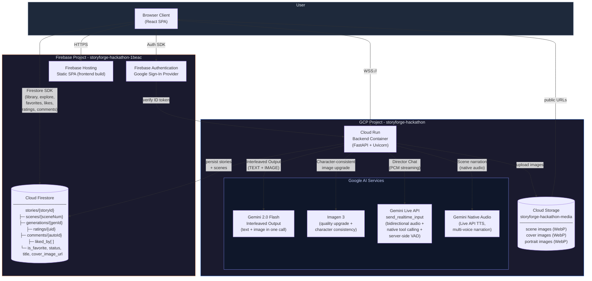
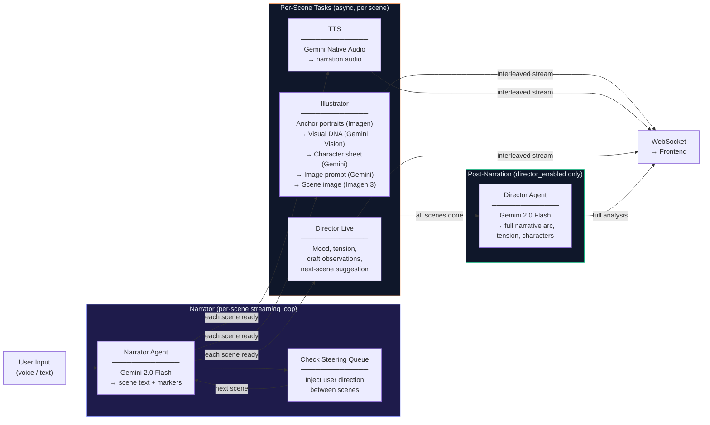
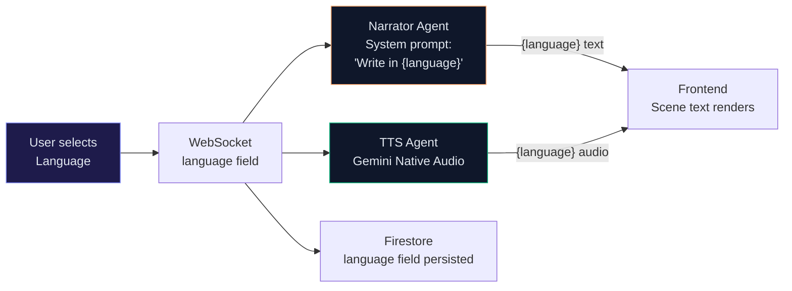
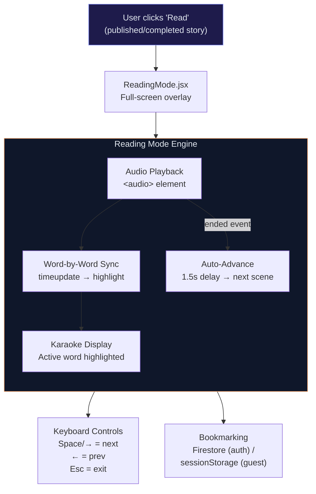
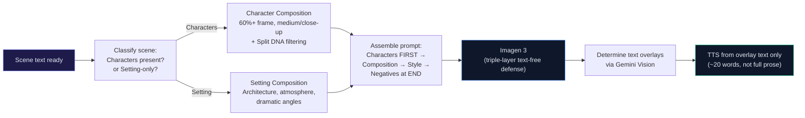
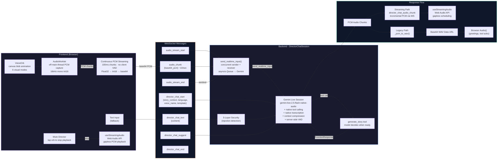
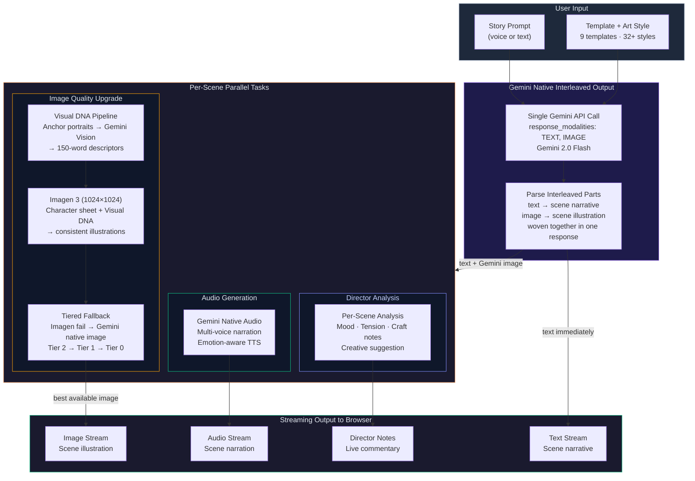

# Reveria

**Stories from your imagination** -an interactive multimodal story engine powered by Google Gemini

Reveria is an interactive multimodal story engine. Users choose a story template, describe a scenario via voice or text -a mystery, a children's bedtime story, a comic adventure, a manga epic -and the agent builds it live. It generates scene illustrations, narrative text, narrated voiceover, and an interactive storybook, all streaming as interleaved output. Users can interrupt and steer the narrative in real-time ("make the villain scarier," "add a plot twist"), and the story dynamically reshapes.

**Killer Feature -Director Chat:** A voice-based brainstorming partner powered by Gemini Live API. Talk through your story ideas with the Director, who listens, suggests creative directions, and triggers generation when the moment is right. A split-screen Director Panel reveals the agent's creative reasoning -narrative structure decisions, tension arcs, character development logic, and per-scene mood analysis.

Built for the [Gemini Live Agent Challenge](https://devpost.com/) (Creative Storyteller Track).

**Repository:** [https://github.com/Dileep2896/reveria.git](https://github.com/Dileep2896/reveria.git)

---

## Hackathon Technology

> **Challenge Requirement:** _Must use Gemini's interleaved/mixed output capabilities. The agents are hosted on Google Cloud._

| Mandatory Requirement         | How Reveria Uses It                                                                                                                                                                                                                                                                                                         |
| ----------------------------- | --------------------------------------------------------------------------------------------------------------------------------------------------------------------------------------------------------------------------------------------------------------------------------------------------------------------------- |
| **Gemini Interleaved Output** | Primary generation path: `response_modalities: ["TEXT", "IMAGE"]` generates story text + scene illustrations in a **single Gemini API call**. See `gemini_client.generate_interleaved()` and `narrator.generate_with_images()`. Imagen 3 runs as a parallel quality upgrade; Gemini native image serves as tier-0 fallback. |
| **Hosted on Google Cloud**    | Backend on **Cloud Run** (FastAPI container), frontend on **Firebase Hosting**, data on **Cloud Firestore** + **Cloud Storage**, AI via **Vertex AI** (Gemini + Imagen). Full CI/CD via GitHub Actions.                                                                                                                     |

### Google AI Services Used

| Service                                   | Usage                                                                            | Key API                                  |
| ----------------------------------------- | -------------------------------------------------------------------------------- | ---------------------------------------- |
| **Gemini 2.0 Flash -Interleaved Output** | Text + image generation in one call                                              | `response_modalities: ["TEXT", "IMAGE"]` |
| **Gemini Live API**                       | Director Chat: bidirectional native audio conversation                           | `send_realtime_input()`, server-side VAD |
| **Gemini Native Audio**                   | Multi-voice scene narration (emotion-aware TTS)                                  | Live API audio output                    |
| **Gemini Vision**                         | Visual DNA extraction from character portraits                                   | `generate_content()` with image input    |
| **Gemini Flash**                          | Story text streaming, character sheets, scene composition, safety classification | `generate_content_stream()`              |
| **Imagen 3**                              | High-quality scene illustrations with character consistency                      | Vertex AI `predict()`                    |
| **Google ADK**                            | Multi-agent orchestration (NarratorADKAgent)                                     | `SequentialAgent`, tool declarations     |

### Key Methods & Patterns

| Pattern                  | Implementation                                                                                            |
| ------------------------ | --------------------------------------------------------------------------------------------------------- |
| Native tool calling      | Director Chat's `generate_story` tool -Gemini decides when brainstorming is done and triggers generation |
| Native transcription     | `input_audio_transcription` + `output_audio_transcription` in Live API session config                     |
| Context compression      | `ContextWindowCompressionConfig(sliding_window=SlidingWindow())` for long conversations                   |
| Server-side VAD          | `AutomaticActivityDetection` with `startOfSpeechSensitivity: HIGH`, `endOfSpeechSensitivity: LOW`         |
| Continuous PCM streaming | AudioWorklet → `send_realtime_input(audio=Blob)` -no client-side speech detection                        |
| Tiered image fallback    | Tier 2 (Imagen) → Tier 1 (Imagen reduced) → Tier 0 (Gemini native interleaved image)                      |
| Per-scene streaming      | Image + audio + director tasks spawn per-scene as narrator text completes                                 |
| Visual DNA pipeline      | Anchor portraits (Imagen) → Gemini Vision analysis → 150-word descriptors → scene prompt injection        |

---

## Screenshots

<table>
<tr>
<td width="50%"><br/><b>Template Chooser</b> - Pick from 9 story templates via a 3D coverflow carousel</td>
<td width="50%"><br/><b>Story Generation</b> - Live text, image, and audio streaming with Director analysis panel</td>
</tr>
<tr>
<td width="50%"><br/><b>Book Details</b> - Published story page with characters, genres, ratings, and social features</td>
<td width="50%"><br/><b>Director Chat</b> - Voice brainstorming with the AI Director powered by Gemini Live API</td>
</tr>
</table>

---

## Features

- **Story Templates** -9 curated templates (Storybook, Comic Book, Webtoon, Hero Quest, Manga, Novel, Diary, Poetry, Photo Journal) with unique cover designs, art styles, and formatting. Template selection via a 3D coverflow carousel before story creation
- **30+ Art Styles** -Cinematic, Watercolor, Comic, Anime, Pixar 3D, Studio Ghibli, Marvel, Cyberpunk, Oil Painting, Pencil Sketch, Classic Comic, Noir Comic, Superhero, Indie Comic, Romantic Webtoon, Action Webtoon, Slice of Life, Fantasy Webtoon, Epic Fantasy, Shonen Manga, Shojo Manga, Seinen Manga, Chibi, Journal Sketch, Ink Wash, Impressionist, Ethereal, Minimalist, Photorealistic, Documentary, Retro Film. Each template gets its own curated subset
- **Multimodal Storytelling** -Text, images, and audio stream together in real-time as an interactive flipbook in spread mode
- **Visual Narrative Templates** -Comic Book, Manga, and Webtoon templates with character-focused composition (60%+ frame), text-free panel art, overlay text placement via Gemini Vision, and sequential image-to-audio pipeline
- **Text-Free Images** -Triple-layer defense for visual narratives: scene composer instruction, positive prefix, art style suffix, and negative constraints ensure clean panel art without text artifacts
- **Voice Input** -Voice capture using Web Audio API for hands-free story steering
- **Audio Narration** -Gemini native audio (via Live API) narrates each scene with expressive, mood-adaptive voiceover
- **Per-Scene Streaming** -Images and audio generate per-scene as text completes, not after all scenes. Scene 1's image paints in while Scene 2 is still being written
- **Cinematic Book Opening** -When the first prompt is sent, the cover page appears with a faux spine, entrance animation with brightness bloom, then a synchronized flip and slide to the first scene
- **Portraits and Visual DNA** -Anchor portraits generated before scene images using Imagen. Gemini Vision analyzes each portrait to extract visual DNA (100-150 word natural-language description), which is used for consistent character rendering across all scenes
- **Hybrid Character Consistency** -Three-stage image pipeline: character sheet extraction, scene composition (Gemini), verbatim character descriptions prepended to prompt. Split DNA separates physical traits from style traits, with outfit descriptions automatically stripped when scene text describes clothing changes
- **Director Chat** -Voice-based brainstorming with the Director using Gemini Live API (`gemini-live-2.5-flash-native-audio`). Continuous PCM streaming via AudioWorklet with Gemini's server-side VAD (no client-side speech detection). Features native tool calling (model decides when to generate), native transcription, `send_realtime_input()` for zero-latency audio delivery, text input fallback, 8 configurable voices, streaming audio for low-latency voice, mute (tap to stop Director audio), and silent re-engagement nudge. After generation, a single combined wrap-up message replaces overlapping audio
- **Director Panel** -A focused sidebar with 4 sections: **Scene Insight Pair** (spread-aware left/right cards with mood, tension bars, and expandable craft notes), **Story Health** (5-dimension quality bars for Pacing, Characters, World, Dialogue, Coherence), **Story Details** (Next Direction, Characters, Visual Style, Themes, Emotional Arc), and **Live Notes** (collapsible director commentary with audio playback). Accumulated scenes persist across batches so analysis always covers the full story
- **Live Director Commentary** -Real-time per-scene creative notes (mood, tension, craft observations) stream to the Director Panel during generation
- **Mid-Generation Steering** -Type direction changes while the story generates. Steering is injected between scenes via the narrator's conversation history
- **Separated Generation Modes** -ControlBar generates stories with narrator + images + audio only (fast, no Director overhead). Director Chat triggers full Director pipeline with live commentary, proactive scene reactions, and creative suggestions
- **Playful Safety Redirect** -Instead of hard error toasts for inappropriate content, the narrator redirects in-character ("That part of the library is forbidden! Let's explore this path instead...")
- **Interactive Flipbook** -Always-spread layout with realistic page-turn animation, keyboard navigation (arrow keys), and dot-based page navigation
- **Firebase Auth** -Google Sign-In + email/password sign-up with email verification
- **Story Persistence** -Cloud Firestore saves stories, scenes, and generations with AI-generated titles and cover images
- **Art Style Memory** -Selected art style is persisted per story and restored when reopening from Library
- **Library** -Personal bookshelf with 3D CSS book cards, favorites (heart toggle), status filters (All/Favorites/Saved/Completed), search, and sort (Recent/Title)
  - **Cover Generation State** -Books awaiting AI covers show a blurred, desaturated placeholder with animated "Painting cover..." overlay that auto-refreshes when complete
  - **Delete with Active Story Cleanup** -Deleting the currently active story properly clears WebSocket state and URL
- **Explore** -Browse publicly published stories with likes, liked filter, search, and sort (Recent/Title/Author)
- **Social Features** -Likes (optimistic toggle), star ratings (with average display), and comments on published stories. Story authors can moderate comments on their own stories
- **Save and Complete Flow** -Save stories to Library, mark as Complete (locks editing), publish to Explore for others to read
- **Completed Book Protection** -Completed books are read-only regardless of entry point (Library or Explore)
- **URL Routing** -Deep-linkable story URLs (`/story/:id?page=N`) with auto-resume on page reload
- **Image Loading States** -"Painting scene" shimmer placeholder while Imagen generates; graceful fallbacks with specific user messages for quota, safety filter, timeout errors
- **Cover Art Style Matching** -AI-generated book covers use the same art style suffix as scene illustrations
- **Glassmorphism UI** -Frosted glass panels with dark/light theme support
- **Toast Notifications** -Global notification system (success/error/warning/info) with auto-dismiss, progress bars, and glassmorphism styling
- **Multi-Language Stories** -Generate stories in 8 languages (English, Spanish, French, German, Japanese, Hindi, Portuguese, Chinese) with Gemini native audio narration
- **Multilingual Template Cards** -Template names, descriptions, and taglines translate to the user's selected language (Hindi, Spanish, French, Japanese, German, Portuguese, Chinese) via a built-in i18n map
- **Language Indicator** -Globe pill in the ControlBar shows the active story language when non-English
- **Generation Stage Messages** -ControlBar shows fun contextual messages during generation ("Summoning the narrator...", "Painting the scene...", "Gathering the portraits...")
- **Share Link** -Copy a public URL for published stories; unauthenticated users can view shared stories with a "Sign in to create" CTA
- **PDF Export** -Download any saved story as a polished PDF storybook with cover page, scene illustrations, decorative typography, and page numbering
- **Reading Mode** -Full-screen immersive experience with karaoke-style word-by-word narration highlighting, auto-advance between scenes, bookmarking, and keyboard controls
- **Author Attribution** -Story author name and photo automatically captured from Firebase Auth and stored on story creation
- **Portal-Based Tooltips** -Custom glassmorphism tooltips using React `createPortal` that escape overflow:hidden containers
- **Smart Regen UX** -Scene regeneration keeps old image visible during generation; failed regen preserves previous image instead of showing error
- **Writing Skeleton Animation** -Animated skeleton lines with typing cursor glow and shimmer sweep during scene generation and rewriting
- **Subscription Tiers** -Free, Standard, and Pro tiers with per-tier usage limits (generations, scene regens, PDF exports); usage tracking via backend `/api/usage` endpoint
- **Admin Dashboard** -Admin-only panel for managing user tiers (promote/demote between free/standard/pro)
- **Pro User Visual Indicators** -Tier-based avatar styling: Pro users get a golden glowing ring + amber "PRO" pill; Standard gets violet ring + pill; Free shows default glass border
- **Theme-Aware Book Shadows** -Light mode uses softer book depth shadows and page gutter shadows via CSS variables
- **Settings Dialog** -Centralized settings for theme (light/dark) and Director voice selection
- **Server-Side VAD** -Gemini's built-in speech activity detection (startSensitivity: HIGH, endSensitivity: LOW) replaces client-side VAD. AudioWorklet streams raw PCM continuously; Gemini decides when the user stopped speaking
- **Hero Mode** -Upload a selfie to become the protagonist; Gemini Vision extracts Visual DNA, injected into character sheets for personalized illustrations in trend art styles
- **Token Expiry Recovery** -Automatic WebSocket reconnection and REST token refresh on auth failure
- **404 Page** -Themed not-found page with navigation to create or explore stories
- **Marble Avatar Fallbacks** -Users without profile photos get unique deterministic marble gradient avatars (via `boring-avatars`)
- **Voice-Reactive Orb** -Canvas-based organic blob animation (`VoiceOrb.jsx`) with 8-point Catmull-Rom spline interpolation and pseudo-noise via overlapping sine waves. Real-time audio amplitude from mic (recording) or streaming audio (Director speaking) drives blob deformation with asymmetric smoothing (fast attack, slow decay). 6 visual modes: idle (violet), recording (red), speaking (amber), loading, watching, waiting. 3-layer composition: outer glow, main gradient, inner specular highlight
- **Streaming Director Audio** -Low-latency PCM audio streaming for Director voice. Backend streams PCM chunks incrementally via WebSocket (`director_chat_audio_chunk` messages) instead of waiting for the full response. Frontend `useStreamingAudio` hook uses Web Audio API to schedule gapless playback -Director's voice starts playing as soon as the first chunk arrives. Legacy `Audio(dataUrl)` path still used for greetings and tool call acknowledgments
- **Mute Director Audio** -Tap the voice orb during Director speech to immediately stop playback. Recording resumes automatically so the user can speak next
- **Echo Prevention** -Recording automatically stops when Director speaks (prevents mic pickup); fresh recording starts 500ms after Director finishes. Server-side VAD + `echoCancellation: true` handle residual echo
- **Director Security (5 Layers)** -Regex input pre-screening (instruction override, role switching, DAN jailbreaks, multi-language injection, structured format injection, encoding tricks), output post-screening (character breaks, prompt leaks, off-topic detection), system prompt identity anchoring, re-anchoring every 5 messages, and flagged streaming audio kill (stops playback immediately when post-screening flags a response)
- **CI/CD Pipeline** -GitHub Actions with 4 jobs: backend tests, frontend tests, backend deploy (Cloud Run), frontend deploy (Firebase Hosting). Auto-deploys on merge to `main`

---

## System Architecture

```mermaid
flowchart TB
    subgraph Frontend["Frontend -React + Vite"]
        direction TB
        Auth["Firebase Auth<br/>(Google Sign-In + Email)"]
        subgraph Views["Application Views"]
            direction LR
            Canvas["Story Canvas<br/>Interactive Flipbook"]
            Director["Director Panel<br/>AI Reasoning Sidebar"]
            Library["Library Page<br/>3D Book Cards"]
            Explore["Explore Page<br/>Public Stories"]
        end
        subgraph Controls["User Input"]
            direction LR
            TextInput["Text Input"]
            VoiceInput["Voice Capture<br/>(AudioWorklet · PCM streaming)"]
            Templates["Template Carousel<br/>9 templates"]
            ArtStyle["Art Style Picker<br/>32+ styles"]
        end
        subgraph Features["Features"]
            direction LR
            ReadMode["Reading Mode<br/>Karaoke Narration"]
            PDFExport["PDF Export<br/>fpdf2 Backend"]
            Social["Social Features<br/>Likes, Ratings, Comments"]
        end
        FSClient["Firestore Client SDK<br/>(Library / Explore queries)"]
    end

    subgraph Backend["Backend -Python FastAPI (Cloud Run)"]
        WS["WebSocket Handler<br/>Session Management"]
        AuthMW["Auth Middleware<br/>(Firebase Admin SDK)"]
        REST["REST API<br/>Social, Usage, Admin,<br/>Stories, PDF Export"]

        subgraph Orchestrator["Story Orchestrator (Google ADK)"]
            direction TB
            Narrator["NarratorADKAgent<br/>Gemini Native Interleaved Output<br/>response_modalities: TEXT + IMAGE"]

            subgraph PerScene["Per-Scene Tasks (asyncio)"]
                direction LR
                Illustrator["Imagen 3 Upgrade<br/>Visual DNA + anchoring"]
                TTS["Gemini Native Audio<br/>Multi-voice TTS"]
                DirectorLive["Director Live<br/>Scene commentary"]
            end

            subgraph PostBatch["Post-Batch Analysis"]
                DirectorAgent["Director Agent<br/>Full story analysis"]
            end

            Narrator -->|"text + image per scene"| PerScene
            PerScene -->|"all scenes done"| PostBatch
        end

        subgraph DirectorChat["Director Chat -Gemini Live API"]
            LiveSession["Gemini Live Session<br/>Bidirectional native audio<br/>+ native tool calling<br/>+ native transcription<br/>+ context compression<br/>+ server-side VAD"]
            Security["5-Layer Security<br/>Input screening<br/>Output monitoring<br/>Identity anchoring<br/>Re-anchoring (every 5 msgs)<br/>Flagged audio kill"]
        end

        Persist["Firestore Client<br/>(persist stories)"]
        Storage["GCS Storage Client<br/>(store images)"]
    end

    subgraph Google["Google AI Services"]
        direction LR
        Gemini["Gemini 2.0 Flash<br/>Interleaved Output<br/>(TEXT + IMAGE)"]
        GeminiLive["Gemini Live API<br/>send_realtime_input<br/>(native audio + VAD)"]
        Imagen["Imagen 3<br/>(Vertex AI<br/>quality upgrade)"]
        NativeAudio["Gemini Native Audio<br/>(TTS via Live API)"]
    end

    subgraph Data["Data Layer"]
        direction LR
        Firestore[("Cloud Firestore<br/>Stories, Scenes,<br/>Generations, Social")]
        GCS[("Cloud Storage<br/>Scene Images,<br/>Cover Images,<br/>Portraits")]
    end

    Auth -.->|ID Token| AuthMW
    Controls -->|"prompt + PCM audio"| WS
    WS -->|"text, image, audio,<br/>director analysis"| Canvas
    WS -->|"director data"| Director
    FSClient <-->|"read/write"| Firestore
    Library & Explore --- FSClient

    WS --> Orchestrator
    Narrator -->|"interleaved generation"| Gemini
    Illustrator -->|"character-consistent upgrade"| Imagen
    DirectorAgent -->|"Gemini API"| Gemini
    TTS -->|"native audio"| NativeAudio

    Persist -->|"save"| Firestore
    Storage -->|"upload"| GCS

    WS -->|"director chat<br/>PCM stream / text"| LiveSession
    LiveSession -->|"Live API +<br/>send_realtime_input"| GeminiLive
    Security -.->|"pre-screen input<br/>post-screen output"| LiveSession

    style Frontend fill:#1a1a2e,stroke:#b48cff,color:#e2e8f0
    style Backend fill:#1a1a2e,stroke:#ffa86c,color:#e2e8f0
    style Google fill:#0f172a,stroke:#3b82f6,color:#e2e8f0
    style Data fill:#0f172a,stroke:#10b981,color:#e2e8f0
    style Orchestrator fill:#1e1b4b,stroke:#818cf8,color:#e2e8f0
    style PerScene fill:#1e1b4b,stroke:#6366f1,color:#c7d2fe
    style PostBatch fill:#1e1b4b,stroke:#6366f1,color:#c7d2fe
    style DirectorChat fill:#1e1b4b,stroke:#6366f1,color:#c7d2fe
```



---

## Cloud Infrastructure



---

## CI/CD Pipeline & Automated Deployment

Reveria uses a fully automated CI/CD pipeline via **GitHub Actions** (see [`.github/workflows/ci.yml`](.github/workflows/ci.yml)). Every push triggers smoke tests; merges to `main` automatically deploy both the backend and frontend -no manual intervention required.


### How It Works

| Step                   | What happens                                                                                     | Infrastructure                   |
| ---------------------- | ------------------------------------------------------------------------------------------------ | -------------------------------- |
| **1. Code pushed**     | GitHub Actions workflow triggers on PR or push to `main`                                         | GitHub Actions                   |
| **2. Backend tests**   | Install deps, `pytest -v` (8 smoke tests with mocked Firebase/Firestore)                         | Ubuntu runner, Python 3.12       |
| **3. Frontend tests**  | `npm ci`, ESLint, `vite build` (dummy env), Playwright smoke tests (3 tests)                     | Ubuntu runner, Node 20, Chromium |
| **4. Deploy backend**  | `gcloud run deploy --source backend` -builds Docker image via Cloud Build, deploys to Cloud Run | GCP Cloud Build, Cloud Run       |
| **5. Deploy frontend** | `npm run build` (production env from GitHub Secrets), `firebase deploy` to Hosting               | Firebase Hosting CDN             |

Deploy jobs **only run on `main`** and **only after both test jobs pass**. PRs run tests only.

### Infrastructure as Code

All deployment infrastructure is defined in version-controlled files:

| File                                                             | Purpose                                               |
| ---------------------------------------------------------------- | ----------------------------------------------------- |
| [`.github/workflows/ci.yml`](.github/workflows/ci.yml)           | Complete CI/CD pipeline -test, build, and deploy     |
| [`backend/Dockerfile`](backend/Dockerfile)                       | Backend container definition (Python 3.12 + FastAPI)  |
| [`frontend/firebase.json`](frontend/firebase.json)               | Firebase Hosting config (SPA rewrites, cache headers) |
| [`frontend/.firebaserc`](frontend/.firebaserc)                   | Firebase project binding                              |
| [`backend/pytest.ini`](backend/pytest.ini)                       | Test runner configuration                             |
| [`frontend/playwright.config.js`](frontend/playwright.config.js) | E2E test configuration                                |

### Secrets Management

Deployment credentials are stored as **GitHub Actions Secrets** (never in code):

- `GCP_SA_KEY` -Service account for Cloud Run deploys (least-privilege: `run.developer`, `artifactregistry.writer`, `storage.admin`)
- `FIREBASE_SERVICE_ACCOUNT` -Service account for Firebase Hosting deploys
- `VITE_FIREBASE_*` / `VITE_WS_URL` -Build-time environment variables injected during production builds

---

## Testing

### Backend (pytest)

8 smoke tests covering health checks, REST route auth enforcement, and Firestore-dependent routes with mocked dependencies:

```bash
cd backend
pip install -r requirements-test.txt
pytest -v
```

| Test                                     | What it verifies                                                                 |
| ---------------------------------------- | -------------------------------------------------------------------------------- |
| `test_health_returns_ok`                 | `GET /health` returns 200, `{status: ok, adk: true}`                             |
| `test_public_story_not_found`            | `GET /api/public/stories/<id>` returns 404 for missing story                     |
| `test_social_stats_not_found`            | `GET /api/public/stories/<id>/social` returns 404                                |
| `test_list_comments_nonexistent_story`   | `GET /api/public/stories/<id>/comments` returns 404 for non-public/missing story |
| `test_delete_story_no_auth`              | `DELETE /api/stories/<id>` without auth returns 422                              |
| `test_get_usage_no_auth`                 | `GET /api/usage` without auth returns 422                                        |
| `test_bookmark_returns_null_for_missing` | Auth'd bookmark request returns `{scene_index: null}`                            |
| `test_delete_story_not_found`            | Auth'd delete of nonexistent story returns 404                                   |

### Frontend (Playwright)

3 Playwright smoke tests verifying pages load without JS crashes:

```bash
cd frontend
npm install
npm run build  # requires VITE_FIREBASE_* env vars (dummy values ok)
npx playwright install chromium
npx playwright test
```

| Test                       | What it verifies                            |
| -------------------------- | ------------------------------------------- |
| `home page loads`          | `/` renders with "Reveria" title, no crash  |
| `book page renders`        | `/book/nonexistent` loads without JS errors |
| `terms page shows content` | `/terms` renders with "Terms" text visible  |

---

## Agent Architecture (ADK)

Reveria uses **Google's Agent Development Kit (ADK)** to orchestrate a multi-agent pipeline. Each agent is a `BaseAgent` subclass that runs autonomously, and the pipeline is composed using ADK's built-in `SequentialAgent` and `ParallelAgent` combinators.

### Pipeline Structure

```
StoryOrchestrator (SequentialAgent)
  ├── NarratorADKAgent (per-scene streaming loop)
  │     ├── Scene text ready ──┬── asyncio.create_task(Illustrator)
  │     │                      ├── asyncio.create_task(TTS)
  │     │                      └── asyncio.create_task(Director Live)  [director_enabled only]
  │     ├── [Check steering queue → inject user direction]
  │     └── await all pending tasks
  └── PostNarrationAgent (ParallelAgent)  [director_enabled only]
        └── DirectorADKAgent     ← full post-batch analysis
```

The pipeline fires per-scene tasks **as each scene completes**. When the Narrator finishes a scene's text, the Illustrator, TTS, and Director Live commentary tasks launch immediately via `asyncio.create_task`. Between scenes, the pipeline checks a **steering queue** for user direction changes and injects them into the narrator's conversation history. After all scenes are written and all per-scene tasks have resolved, the PostNarrationAgent runs the Director's full post-batch analysis (only when triggered from Director Chat).

Scene count is hardcoded to 1 per generation cycle for focused, high-quality output.

### Shared State Pattern

ADK session state returns copies (not references), so agents can't communicate through it. Instead, we use a **`SharedPipelineState`** -a mutable Python object passed by reference to every agent:

```python
class SharedPipelineState:
    user_input: str          # The user's prompt
    art_style: str           # Selected visual style (e.g. "watercolor")
    scenes: list[dict]       # Populated by Narrator, consumed by Illustrator/TTS
    full_story: str          # Concatenated scene text for Director analysis
    ws_callback: Callable    # WebSocket send function for real-time streaming
    story_id: str            # Firestore document ID for GCS uploads
    director_result: dict    # Populated by Director, read by main.py for persistence
    steering_queue: asyncio.Queue[str]  # Mid-generation user directions
    director_enabled: bool   # Controls all Director work
    director_chat_session    # Gemini Live session (when director_enabled)
    director_suggestion: str # Next-batch creative direction from Director
```

The caller sets input fields before each pipeline run. Agents write their outputs back to shared state, enabling downstream consumers and the WebSocket handler to read results.

### Agent Deep Dives

#### 1. Narrator Agent

The Narrator is the story engine. It takes user prompts and generates structured narrative text with `[SCENE]` markers.

| Aspect           | Detail                                                            |
| ---------------- | ----------------------------------------------------------------- |
| **Model**        | Gemini 2.0 Flash (temperature 0.9 for creative variety)           |
| **Input**        | User prompt + conversation history + Director suggestion (if any) |
| **Output**       | Streamed text with `[SCENE]` delimiters                           |
| **Scene length** | 80-100 words per scene (enforced via system prompt)               |
| **Memory**       | Sliding window of last 10 conversation turns (~8K tokens)         |

**How it works:**

1. The system prompt instructs Gemini to write in present tense, third person, with `[SCENE]` markers between scenes
2. Text is **streamed** chunk-by-chunk -the ADK agent buffers chunks and splits on `[SCENE]` markers as they arrive
3. Each completed scene is immediately sent to the frontend via WebSocket (the user sees text appear in real-time)
4. Conversation history is maintained across prompts, enabling **story steering**
5. If a Director suggestion exists, it is injected at the start of the batch as `[Director's creative direction: ...]`
6. History is trimmed to a sliding window of 10 turns (20 entries) to stay within context limits
7. **Gemini Native Interleaved Output**: The primary generation path uses `response_modalities: ["TEXT", "IMAGE"]` to generate text and images together in a single Gemini call. Scene images from Imagen 3 (with full character consistency pipeline) always take priority; the Gemini native image is used only as a fallback when Imagen fails entirely (tier 0)

#### 2. Illustrator Agent

The Illustrator generates visually consistent scene illustrations through a multi-stage pipeline.

```
Step 1: Anchor Portraits (Imagen 3, before scenes)
  └─ Generate character portraits → Gemini Vision → Visual DNA extraction
       100-150 word natural-language description per character

Step 2: Character Sheet Extraction (Gemini, temp 0.1)
  └─ Reads accumulated story text → outputs structured character descriptions
       with hex color codes, face shapes, signature items, dominant palette

Step 3: Image Prompt Engineering (Gemini, temp 0.3)
  └─ Takes scene text + character sheet + visual DNA → crafts an optimized Imagen prompt
       Visual DNA preferred over raw sheet lines; 100-word scene composition limit

Step 4: Image Generation (Imagen 3)
  └─ Generates the final illustration at 16:9 aspect ratio
```

**Character consistency** is the key challenge. The Illustrator maintains:

- A persistent character sheet that accumulates across story continuations
- Visual DNA from anchor portraits (vision-anchored descriptions)
- Split DNA: physical traits separated from style traits, with outfit stripping when scene text describes clothing changes
- Anti-drift anchoring: "Render EXACTLY as described" between character block and scene composition

**Visual narrative templates** (Comic/Manga/Webtoon) use a triple-layer defense for text-free images: scene composer instruction, positive prefix, art style suffix, and negative constraints ensure clean panel art.

**Art styles** are appended as suffixes to the image prompt. Each of the 30+ styles includes 20-25 words of rendering details (volumetric lighting, paper texture, etc.). Each template gets its own curated subset of styles.

#### 3. Director Agent

The Director provides **meta-commentary** on the creative process -the "why" behind story decisions. Beyond analysis, the Director actively shapes the story: each per-scene analysis includes a `suggestion` field -a bold creative direction for what should happen next. This suggestion is automatically injected into the Narrator's context for the following batch.

| Aspect         | Detail                                                                 |
| -------------- | ---------------------------------------------------------------------- |
| **Model**      | Gemini 2.0 Flash (temperature 0.4, JSON response mode)                 |
| **Input**      | Full story text + user prompt + art style                              |
| **Output**     | Structured JSON with 4 analysis categories                             |
| **Live Notes** | Per-scene: thought, mood, tension_level, craft_note, emoji, suggestion |

**Output structure:**

```json
{
  "narrative_arc": {
    "summary": "Building tension through environmental storytelling",
    "stage": "rising_action",
    "pacing": "moderate",
    "detail": "The narrative opens with sensory immersion..."
  },
  "characters": {
    "summary": "Two protagonists with opposing motivations",
    "list": [{ "name": "Elena", "role": "detective", "trait": "determined" }],
    "detail": "Elena's stubbornness creates natural conflict..."
  },
  "tension": {
    "summary": "Steady escalation with a false resolution",
    "levels": [4, 7],
    "trend": "rising",
    "detail": "Tension rises as the discovery unfolds..."
  },
  "visual_style": {
    "summary": "Noir atmosphere with muted warmth",
    "tags": ["low-key lighting", "urban decay", "rain-slicked"],
    "mood": "mysterious",
    "detail": "The watercolor style softens the noir edges..."
  }
}
```

The frontend renders this in the Director Panel as 4 focused sections: **SceneInsightPair** (spread-aware left/right cards matching the book's open pages, with emoji, mood, tension bar, and expandable craft notes -uses `spreadLeftPage()` for spread mapping with multi-source fallbacks from liveNotes to directorData), **StoryHealthCard** (collapsible card with 5 dimension bars and average score), **StoryDetails** (compact cards for Next Direction, Characters, Visual Style, Themes, Emotional Arc), and **Live Notes** (collapsible commentary with audio playback).

#### 4. TTS Agent

The TTS Agent generates narration audio for each scene using **Gemini Native Audio** (via the Live API with `gemini-2.5-flash-native-audio`). Audio is generated per-scene with expressive, mood-adaptive voiceover. For visual narrative templates, TTS narrates only overlay text (~20 words) rather than full prose.

### Service Layer

The agents are backed by service modules:

| Service             | Role                        | Key Details                                                                                                 |
| ------------------- | --------------------------- | ----------------------------------------------------------------------------------------------------------- |
| `gemini_client.py`  | Gemini API wrapper          | Singleton client, streaming generation, retry utility with transient error detection                        |
| `imagen_client.py`  | Imagen 3 wrapper            | Per-user circuit breaker, module-level `asyncio.Semaphore(1)` serializing all calls, jitter on retry delays |
| `tts_client.py`     | Gemini Native Audio wrapper | WAV output via Live API, mood-adaptive narration, proportional silence insertion on segment failure         |
| `storage_client.py` | GCS wrapper                 | Retry + signed URL fallback if `make_public()` fails                                                        |
| `director_chat.py`  | Director Chat session       | Gemini Live API with native tool calling, transcription, context compression                                |

### Resilience Patterns

- **Per-user circuit breaker** (Imagen): After consecutive 429 errors, the circuit breaker trips per-uid. During cooldown, all image generation calls return immediately with `quota_exhausted` instead of making API calls
- **Graceful image fallback**: When image generation fails (quota, safety filter, timeout), the frontend shows the scene text immediately instead of waiting. Error-specific messages tell users what happened
- **Connection-aware abort**: The WebSocket handler tracks `connection_alive` -if the client disconnects mid-generation, the pipeline aborts early to save API budget
- **Character sheet preservation**: On extraction failure or NONE result, the existing character sheet is preserved (not cleared)
- **Atomic usage tracking**: Firestore transactions for increment/decrement operations
- **Batched Firestore deletions**: 450-doc batches for story deletion
- **Retry utility**: `is_transient(exc)` + `with_retries()` for Gemini API calls

### Orchestration Flow



### Multi-Language Pipeline



### Reading Mode Architecture



### Visual Narrative Pipeline (Comic/Manga/Webtoon)



### Director Chat Architecture (Gemini Live API)



**During generation**, the Director Chat session stays active. After generation completes, `generation_wrapup()` sends a single combined wrap-up message through the chat, avoiding overlapping audio. Director voice responses stream as incremental PCM chunks via `director_chat_audio_chunk` WebSocket messages for low-latency playback -the user hears the Director's voice as soon as the first chunk arrives. Audio input uses continuous PCM streaming via `send_realtime_input()` with Gemini's server-side VAD detecting speech boundaries -no client-side voice activity detection. Mute is supported: tapping the voice orb during Director speech immediately stops all audio playback.

---

## Interleaved Output Strategy

Reveria uses **Gemini Native Interleaved Output** (`response_modalities: ["TEXT", "IMAGE"]`) as its **primary generation path** -the mandatory technology for this hackathon challenge. A single Gemini API call produces both story text and scene illustrations woven together. Imagen 3 runs as a parallel quality upgrade for character consistency (Visual DNA pipeline), with the Gemini native image as tier-0 fallback when Imagen fails.



The output _weaves_ modalities together per scene, not sequentially:

```
[TEXT]      "The detective pushed open the creaking door..."
[IMAGE]    → generated: dimly lit doorway, noir style (Gemini interleaved + Imagen upgrade)
[AUDIO]    → narration of the text with gravelly voice (Gemini Native Audio)
[DIRECTOR] → "Opening with sensory detail (sound) to build tension. Noir palette chosen to match mystery genre."

[TEXT]      "Inside, the room was chaos - papers scattered, a chair overturned..."
[IMAGE]    → generated: ransacked office interior (same characters, consistent Visual DNA)
[AUDIO]    → narration continues, tone shifts to urgency
[DIRECTOR] → "Escalating visual disorder signals rising stakes. No body yet - withholding the payoff."
```

---

## Tech Stack

| Layer              | Technology                                               | Purpose                                                                     |
| ------------------ | -------------------------------------------------------- | --------------------------------------------------------------------------- |
| Frontend           | React + Vite                                             | Story canvas, template carousel, director mode, library, explore            |
| Styling            | CSS (glassmorphism)                                      | Frosted glass panels, dark/light theme, Dream Violet / Story Amber branding |
| Auth               | Firebase Authentication                                  | Google Sign-In + email/password for user accounts                           |
| Voice Input        | Web Audio API + AudioWorklet                             | Continuous PCM streaming for Director Chat; server-side VAD                 |
| Real-time Comms    | WebSocket (native)                                       | Stream interleaved output to client                                         |
| Backend            | Python 3.12 + FastAPI + Uvicorn                          | WebSocket handler, orchestration, REST API                                  |
| Agent Framework    | Google ADK (Agent Development Kit)                       | Multi-agent orchestration                                                   |
| LLM                | Gemini 2.0 Flash (Vertex AI)                             | Story generation, character sheets, scene composition, prompt validation    |
| Interleaved Output | Gemini Native (`response_modalities: ["TEXT", "IMAGE"]`) | Text+image generation in a single call (tier-0 fallback for Imagen)         |
| Image Gen          | Imagen 3 (Vertex AI)                                     | Scene illustrations, book covers, character portraits                       |
| Director Chat      | Gemini Live API (`gemini-live-2.5-flash-native-audio`)   | Real-time voice brainstorming with native tool calling and transcription    |
| Voice Output       | Gemini Native Audio (Live API)                           | Expressive, mood-adaptive story narration                                   |
| Audio Streaming    | Web Audio API (AudioContext)                             | Low-latency gapless PCM playback for Director voice streaming               |
| Vision             | Gemini Vision                                            | Visual DNA extraction from portraits, text overlay placement                |
| Database           | Cloud Firestore                                          | Story persistence, user libraries, likes, ratings, comments                 |
| Object Storage     | Google Cloud Storage                                     | Scene images, cover images, portrait images                                 |
| Hosting            | Google Cloud Run                                         | Containerized backend deployment                                            |
| Static Hosting     | Firebase Hosting                                         | Frontend SPA                                                                |
| Container          | Docker                                                   | Reproducible builds                                                         |
| CI/CD              | GitHub Actions (4 jobs)                                  | Automated test + deploy pipeline                                            |
| Backend Tests      | pytest + httpx                                           | Smoke tests with mocked Firebase/Firestore                                  |
| Frontend Tests     | Playwright                                               | Browser smoke tests (Chromium)                                              |
| PDF Generation     | fpdf2                                                    | Storybook PDF export with images                                            |

---

## Project Structure

```
storyforge/
├── frontend/
│   ├── src/
│   │   ├── App.jsx                    # Main app - routing, header, save/complete/publish flows
│   │   ├── firebase.js                # Firebase config and Firestore exports
│   │   ├── routes.js                  # Centralized route path constants (ROUTES object)
│   │   ├── components/
│   │   │   ├── UserAvatar.jsx          # Reusable avatar with marble gradient fallback (boring-avatars)
│   │   │   ├── Logo.jsx + Logo.css    # Animated Reveria logo (dream orb + book curve + sparks)
│   │   │   ├── StoryCanvas.jsx        # Flipbook with page-turn animation (always spread)
│   │   │   ├── SceneCard.jsx          # Scene: image + text + audio with drop cap
│   │   │   ├── BookNavigation.jsx     # Dot navigation + arrow controls
│   │   │   ├── DirectorPanel.jsx      # Director reasoning sidebar
│   │   │   ├── ControlBar.jsx         # Input + template selector + art style pills + voice
│   │   │   ├── LibraryPage.jsx        # User's book library with 3D cards
│   │   │   ├── ExplorePage.jsx        # Public story browser with likes
│   │   │   ├── BookDetailsPage.jsx    # Public book view with likes, ratings, comments
│   │   │   ├── ReadingMode.jsx        # Full-screen reading with karaoke narration
│   │   │   ├── PortraitGallery.jsx    # Horizontal scroll character portraits
│   │   │   ├── SplashScreen.jsx       # Loading splash with branded animation
│   │   │   ├── AuthScreen.jsx         # Sign-in/sign-up with Google + email/password
│   │   │   ├── VoiceOrb.jsx            # Canvas voice-reactive blob animation (6 modes)
│   │   │   ├── DirectorChat.jsx       # Voice/text brainstorming with Director (Gemini Live)
│   │   │   ├── SettingsDialog.jsx     # Theme + Director voice settings dialog
│   │   │   ├── AdminDashboard.jsx     # Admin panel for user tier management
│   │   │   ├── SubscriptionPage.jsx   # Subscription tier display and management
│   │   │   ├── Tooltip.jsx            # Portal-based glassmorphism tooltip (400ms delay)
│   │   │   ├── IconBtn.jsx            # Icon button with built-in tooltip
│   │   │   ├── scene/                 # SceneCard sub-components
│   │   │   │   ├── SceneComposing.jsx # Skeleton loading state
│   │   │   │   ├── SceneHeader.jsx    # Badge, title, audio, action buttons
│   │   │   │   ├── SceneImageArea.jsx # Image + shimmer + regen overlay
│   │   │   │   ├── SceneTextArea.jsx  # Drop-cap text + writing skeleton
│   │   │   │   └── WritingSkeleton.jsx# Shared typing animation skeleton
│   │   │   ├── director/              # DirectorPanel sub-components
│   │   │   │   ├── DirectorEmptyState.jsx
│   │   │   │   ├── SceneInsightPair.jsx  # Spread-aware scene insight cards (left/right)
│   │   │   │   ├── StoryHealthCard.jsx   # Story quality dimension bars
│   │   │   │   └── StoryDetails.jsx      # Characters, themes, visual style, next direction
│   │   │   ├── storybook/            # StoryCanvas sub-components
│   │   │   │   ├── CoverPage.jsx      # Themed covers per template
│   │   │   │   ├── EmptyPageContent.jsx
│   │   │   │   └── GeneratingContent.jsx
│   │   │   └── storybook.css          # Flipbook & page styles
│   │   ├── contexts/
│   │   │   ├── ThemeContext.jsx        # Dark/light mode
│   │   │   ├── SceneActionsContext.jsx # Per-scene action dispatch (regen/delete)
│   │   │   └── ToastContext.jsx        # Global toast notifications
│   │   ├── hooks/
│   │   │   ├── useWebSocket.js        # WebSocket connection + story load/resume
│   │   │   ├── wsHandlers.js          # WS message handler dispatch map
│   │   │   ├── useStoryNavigation.js  # Page nav, keyboard, URL sync
│   │   │   ├── useBookSize.js         # Responsive book sizing
│   │   │   ├── useAppEffects.js       # App-level useEffect hooks
│   │   │   ├── useVoiceCapture.js     # AudioWorklet PCM streaming (no client VAD)
│   │   │   ├── useAuth.js             # Firebase Auth hook (Google + email/password)
│   │   │   ├── useUsage.js            # Usage tracking hook (generations, regens, exports)
│   │   │   ├── useStreamingAudio.js   # Web Audio API streaming playback for PCM chunks
│   │   │   └── useAdminUsers.js       # Admin user management hook
│   │   ├── utils/
│   │   │   └── audioPlayer.js         # Queue and play TTS audio chunks
│   │   ├── theme.css                  # Centralized glassmorphism theme
│   │   └── index.css                  # Global styles
│   ├── tests/
│   │   └── smoke.spec.js              # Playwright smoke tests (3 tests)
│   ├── playwright.config.js           # Playwright config (vite preview, chromium)
│   ├── firebase.json                  # Firebase Hosting config
│   ├── public/
│   ├── Dockerfile
│   └── package.json
├── backend/
│   ├── main.py                        # FastAPI + WebSocket endpoint
│   ├── handlers/
│   │   ├── scene_actions.py           # Regen image/scene, delete scene
│   │   ├── director_chat_handlers.py  # Director Chat WS message handlers + screening
│   │   └── ws_resume.py              # Resume, auto-recover, reset
│   ├── agents/
│   │   ├── orchestrator.py            # ADK root agent - coordinates all agents
│   │   ├── narrator.py                # Story text generation agent (narrator_agent.py)
│   │   ├── illustrator.py             # Image generation agent with visual DNA
│   │   └── director.py                # Creative reasoning agent
│   ├── routers/
│   │   ├── admin.py                   # Admin endpoints (user tier management)
│   │   ├── usage.py                   # Usage tracking endpoints
│   │   ├── social.py                  # Social endpoints (ratings, comments)
│   │   ├── stories.py                 # Story CRUD + PDF export endpoints
│   │   └── book_details.py            # Public book details endpoint
│   ├── services/
│   │   ├── gemini_client.py           # Gemini API wrapper (GenAI SDK)
│   │   ├── director_chat.py           # Director Chat session (Gemini Live API)
│   │   ├── director_chat_audio.py     # Audio collection and streaming for Director Chat
│   │   ├── director_chat_prompts.py   # Model config + tool declarations
│   │   ├── director_chat_security.py  # Prompt injection detection
│   │   ├── imagen_client.py           # Imagen 3 via Vertex AI (per-user circuit breaker)
│   │   ├── tts_client.py              # Gemini Native Audio (Live API)
│   │   ├── hero_service.py            # Hero photo visual DNA extraction
│   │   ├── scene_rewrite.py           # Scene regeneration service
│   │   ├── pdf_export.py              # PDF storybook generation (fpdf2)
│   │   ├── storage_client.py          # GCS with retry + signed URL fallback
│   │   ├── usage.py                   # Per-tier usage limits + atomic tracking
│   │   ├── auth.py                    # Firebase Auth verification + admin checks
│   │   └── firestore_client.py        # Firestore persistence utilities
│   ├── utils/
│   │   └── retry.py                   # Transient error detection + retry wrapper
│   ├── tests/
│   │   ├── conftest.py                # Shared fixtures (mock Firebase, Firestore, auth)
│   │   ├── test_health.py             # Health endpoint smoke test
│   │   └── test_routes.py             # REST route smoke tests (7 tests)
│   ├── requirements.txt
│   ├── requirements-test.txt          # Test deps (pytest, httpx)
│   ├── pytest.ini                     # pytest config (asyncio_mode=auto)
│   └── Dockerfile
├── .github/
│   └── workflows/
│       └── ci.yml                     # CI/CD: test on PR, deploy on merge to main
├── docker-compose.yml                 # Local dev environment
├── HISTORY.md                         # Detailed development history
└── README.md
```

---

## Quick Start

### Prerequisites

- Node.js 20+
- Python 3.12+
- Docker (optional, for containerized dev)
- Google Cloud account with Vertex AI, Gemini API, and Firestore APIs enabled

### 1. Clone & Install

```bash
git clone https://github.com/Dileep2896/reveria.git
cd storyforge
```

### 2. Backend Setup

```bash
cd backend
python3 -m venv .venv
source .venv/bin/activate
pip install -r requirements.txt

# Configure environment
cp .env.example .env
# Edit .env with your API keys
```

### 3. Frontend Setup

```bash
cd frontend
npm install
```

### 4. Run Locally

```bash
# Terminal 1 (Backend)
cd backend && source .venv/bin/activate
uvicorn main:app --reload --port 8000

# Terminal 2 (Frontend)
cd frontend
npm run dev
```

Open **http://localhost:5173**, choose a story template, type a prompt, and watch it generate live.

### 5. Run with Docker

```bash
docker compose up --build
```

---

## GCP Setup

```bash
# Authenticate
gcloud auth login
gcloud config set project storyforge-hackathon

# Enable required APIs
gcloud services enable \
  aiplatform.googleapis.com \
  run.googleapis.com \
  generativelanguage.googleapis.com \
  firestore.googleapis.com

# Set application default credentials
gcloud auth application-default login
gcloud auth application-default set-quota-project storyforge-hackathon
```

---

## Environment Variables

```env
# Google Cloud
GOOGLE_CLOUD_PROJECT=storyforge-hackathon
GOOGLE_APPLICATION_CREDENTIALS=./credentials.json

# Gemini
GEMINI_API_KEY=your-api-key
GEMINI_MODEL=gemini-2.0-flash

# Vertex AI (for Imagen)
VERTEX_AI_LOCATION=us-central1

# Firestore
FIRESTORE_COLLECTION=story_sessions

# Frontend (build-time)
VITE_WS_URL=ws://localhost:8000/ws
```

---

## What's Working

- All features listed above are fully implemented and functional
- **9 story templates** with unique covers, art styles, and formatting via 3D coverflow carousel
- **30+ art styles** with per-template curated subsets
- **Visual narrative templates** (Comic/Manga/Webtoon) with text-free panel art and Gemini Vision overlay placement
- **Portraits and Visual DNA** for character consistency across scenes
- **Cinematic book opening** with cover pulse, entrance animation, and synchronized page flip
- **Director Chat** with Gemini Live API -native audio, tool calling, transcription, single combined wrap-up after generation
- **Social features** -likes, ratings, and comments on published stories
- **Automated CI/CD** -GitHub Actions runs tests on every PR and auto-deploys to Cloud Run + Firebase Hosting on merge to `main`
- **Backend smoke tests** -8 pytest tests with mocked Firebase/Firestore
- **Frontend smoke tests** -3 Playwright browser tests
- **Per-scene streaming** -image + audio generation fires per-scene (not batch), reducing perceived latency
- **Director Panel redesign** -4 focused sections (Scene Insight Pair, Story Health, Story Details, Live Notes) replacing the previous 9-card layout. Accumulated scenes persist across batches for complete analysis
- **Mid-generation steering** -users can steer the story while it generates (injected between scenes)
- **Playful safety redirect** -narrator redirects inappropriate requests in-character instead of hard error
- **Gemini Native Interleaved Output** -Primary generation uses `response_modalities: ["TEXT", "IMAGE"]` for text+image in a single call. Imagen 3 is always primary for character-consistent images; Gemini native image serves as tier-0 fallback

---

## License

MIT
