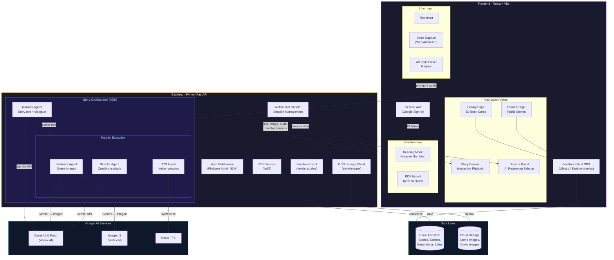
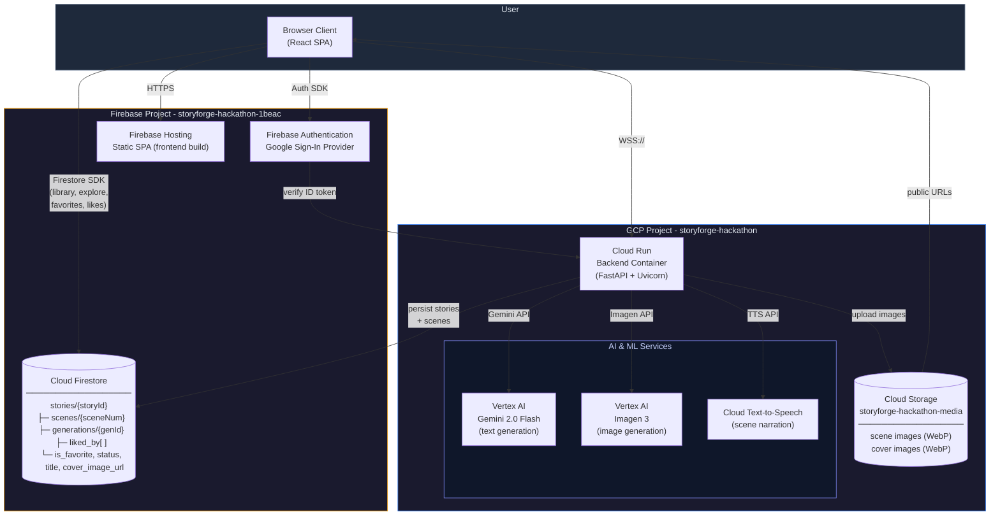
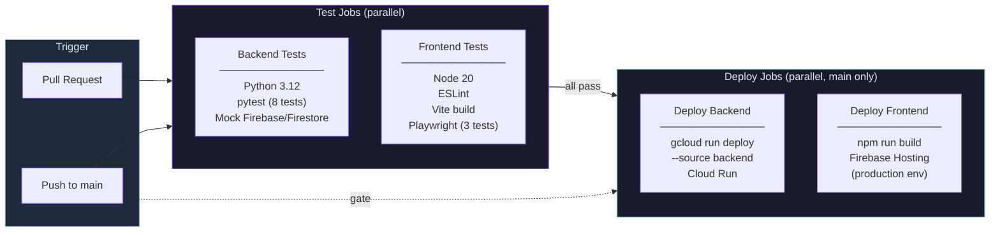
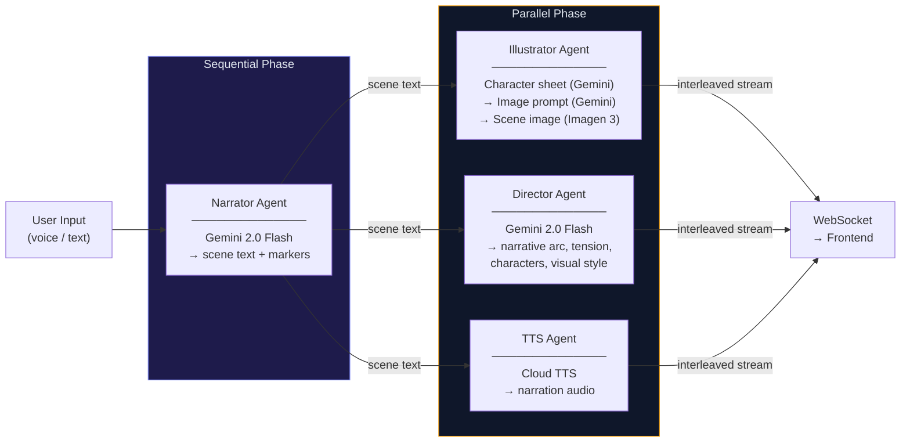
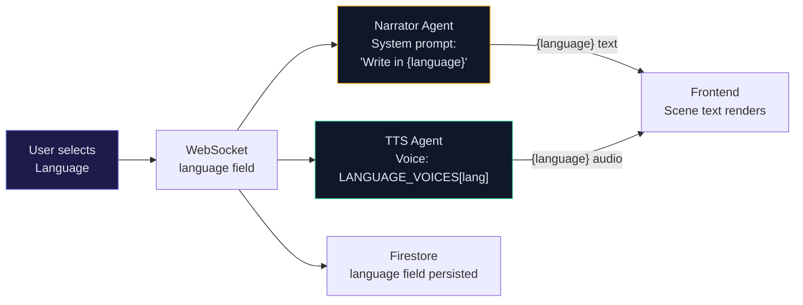
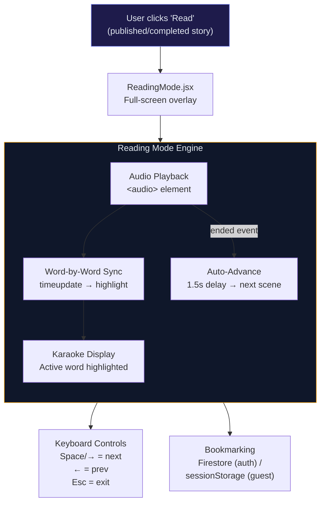
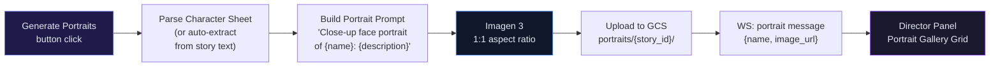

# StoryForge

**An interactive multimodal story engine powered by Google Gemini**

StoryForge is an interactive multimodal story engine. Users describe a scenario via voice or text - a mystery, a children's bedtime story, a historical event - and the agent builds it live. It generates scene illustrations, narrative text, narrated voiceover, and an interactive storyboard, all streaming as interleaved output. Users can interrupt and steer the narrative in real-time ("make the villain scarier," "add a plot twist"), and the story dynamically reshapes.

**Killer Feature - Director Mode:** A split-screen view where the left panel shows the final story output and the right panel reveals the agent's creative reasoning - why it chose certain imagery, narrative structure decisions, tension arcs, and character development logic. This makes the agent architecture *visible* to judges.

Built for the [Gemini Live Agent Challenge](https://devpost.com/) (Creative Storyteller Track).

---

## Features

- **Multimodal Storytelling** - Text, images, and audio stream together in real-time as an interactive flipbook
- **Voice Input** - Hold-to-talk voice capture using Web Audio API for hands-free story steering
- **Audio Narration** - Google Cloud Text-to-Speech narrates each scene with distinct character voices
- **Art Style Selection** - Choose from 6 visual styles: Cinematic, Watercolor, Comic Book, Anime, Oil Painting, Pencil Sketch
- **Genre Quick-Start** - Click a genre pill (Mystery, Fantasy, Sci-Fi, Horror, Children's) to populate a starter prompt
- **Story Continuation & Steering** - Send follow-up prompts to continue, redirect, or reshape the story mid-flow
- **Director Mode** - A sidebar panel revealing the agent's creative reasoning: narrative structure, tension arcs, character development, and visual decisions
- **Tension Arc Visualization** - Live graph showing narrative tension across scenes
- **Interactive Flipbook** - Pages flip with realistic animation, keyboard navigation (arrow keys), and dot-based page navigation
- **Hybrid Character Consistency** - Three-stage image pipeline: character sheet extraction → scene composition (Gemini) → verbatim character descriptions prepended to prompt. Character details reach Imagen without being summarized.
- **NSFW/Safety Content Filtering** - Refusal detection intercepts AI-generated safety responses before they reach the frontend. Users see a clean error toast instead of garbled refusal text.
- **Firebase Auth** - Google Sign-In + email/password sign-up with email verification
- **Story Persistence** - Cloud Firestore saves stories, scenes, and generations with AI-generated titles and cover images
- **Art Style Memory** - Selected art style is persisted per story and restored when reopening from Library
- **Library** - Personal bookshelf with 3D CSS book cards, favorites (heart toggle), status filters (All/Favorites/Saved/Completed), search, and sort (Recent/Title)
  - **Cover Generation State** - Books awaiting AI covers show a blurred, desaturated placeholder with animated "Painting cover..." overlay that auto-refreshes when complete
  - **Delete with Active Story Cleanup** - Deleting the currently active story properly clears WebSocket state and URL
- **Explore** - Browse publicly published stories with likes, liked filter, search, and sort (Recent/Title/Author)
- **Save & Complete Flow** - Save stories to Library, mark as Complete (locks editing), publish to Explore for others to read
- **Completed Book Protection** - Completed books are read-only regardless of entry point (Library or Explore)
- **URL Routing** - Deep-linkable story URLs (`/story/:id?page=N`) with auto-resume on page reload
- **Image Loading States** - "Painting scene" shimmer placeholder while Imagen generates; graceful fallbacks with specific user messages for quota, safety filter, timeout errors
- **Cover Art Style Matching** - AI-generated book covers use the same art style suffix as scene illustrations
- **Glassmorphism UI** - Frosted glass panels with dark/light theme support
- **Toast Notifications** - Global notification system (success/error/warning/info) with auto-dismiss, progress bars, and glassmorphism styling
- **New Story** - Start fresh at any time with the New Story button - resets both frontend and backend state
- **Multi-Language Stories** - Generate stories in 8 languages (English, Spanish, French, German, Japanese, Hindi, Portuguese, Chinese) with automatic TTS voice selection per language
- **Animated Book Entrance** - Smooth entrance animation when the storybook first appears on canvas
- **Share Link** - Copy a public URL for published stories; unauthenticated users can view shared stories with a "Sign in to create" CTA
- **PDF Export** - Download any saved story as a polished PDF storybook with cover page, scene illustrations, decorative typography, and page numbering
- **Reading Mode** - Full-screen immersive experience with karaoke-style word-by-word narration highlighting, auto-advance between scenes, bookmarking, and keyboard controls
- **Character Portrait Gallery** - Generate character face portraits from the Illustrator's character sheet; displayed as circular thumbnails in the Director Panel
- **Author Attribution** - Story author name and photo automatically captured from Firebase Auth and stored on story creation; used in publish flow and BookDetailsPage
- **Complete & Publish Flow** - Confirmation dialogs for completing and publishing stories; publishing is permanent and creates a shareable public link
- **Portal-Based Tooltips** - Custom glassmorphism tooltips using React `createPortal` that escape overflow:hidden containers
- **Scene Delete Confirmation** - Portal-based confirmation dialog with scene title preview, matching Library's glassmorphism design
- **Smart Regen UX** - Scene regeneration keeps old image visible during generation; failed regen preserves previous image instead of showing error
- **Writing Skeleton Animation** - Animated skeleton lines with typing cursor glow and shimmer sweep, shown during both initial scene generation and scene rewriting
- **Subscription Tiers** - Free, Standard, and Pro tiers with per-tier usage limits (generations, scene regens, PDF exports); usage tracking via backend `/api/usage` endpoint
- **Admin Dashboard** - Admin-only panel for managing user tiers (promote/demote between free/standard/pro)
- **Pro User Visual Indicators** - Tier-based avatar styling: Pro users get a golden glowing ring (pulse animation) + amber "PRO" pill in profile dropdown; Standard gets violet ring + pill; Free shows default glass border
- **Theme-Aware Book Shadows** - Light mode uses softer book depth shadows and page gutter shadows via CSS variables; react-pageflip's canvas shadow opacity adapts per theme
- **Modular Codebase** - 7 monolithic files decomposed into ~22 focused modules (all under 320 lines) for maintainability

---

## System Architecture



---

## Cloud Infrastructure



---

## CI/CD Pipeline & Automated Deployment

StoryForge uses a fully automated CI/CD pipeline via **GitHub Actions** (see [`.github/workflows/ci.yml`](.github/workflows/ci.yml)). Every push triggers smoke tests; merges to `main` automatically deploy both the backend and frontend — no manual intervention required.



### How It Works

| Step | What happens | Infrastructure |
|------|-------------|----------------|
| **1. Code pushed** | GitHub Actions workflow triggers on PR or push to `main` | GitHub Actions |
| **2. Backend tests** | Install deps → `pytest -v` (8 smoke tests with mocked Firebase/Firestore) | Ubuntu runner, Python 3.12 |
| **3. Frontend tests** | `npm ci` → ESLint → `vite build` (dummy env) → Playwright smoke tests (3 tests) | Ubuntu runner, Node 20, Chromium |
| **4. Deploy backend** | `gcloud run deploy --source backend` — builds Docker image via Cloud Build, deploys to Cloud Run | GCP Cloud Build → Cloud Run |
| **5. Deploy frontend** | `npm run build` (production env from GitHub Secrets) → `firebase deploy` to Hosting | Firebase Hosting CDN |

Deploy jobs **only run on `main`** and **only after both test jobs pass**. PRs run tests only.

### Infrastructure as Code

All deployment infrastructure is defined in version-controlled files:

| File | Purpose |
|------|---------|
| [`.github/workflows/ci.yml`](.github/workflows/ci.yml) | Complete CI/CD pipeline — test, build, and deploy |
| [`backend/Dockerfile`](backend/Dockerfile) | Backend container definition (Python 3.12 + FastAPI) |
| [`frontend/firebase.json`](frontend/firebase.json) | Firebase Hosting config (SPA rewrites, cache headers) |
| [`frontend/.firebaserc`](frontend/.firebaserc) | Firebase project binding |
| [`backend/pytest.ini`](backend/pytest.ini) | Test runner configuration |
| [`frontend/playwright.config.js`](frontend/playwright.config.js) | E2E test configuration |

### Secrets Management

Deployment credentials are stored as **GitHub Actions Secrets** (never in code):
- `GCP_SA_KEY` — Service account for Cloud Run deploys (least-privilege: `run.developer`, `artifactregistry.writer`, `storage.admin`)
- `FIREBASE_SERVICE_ACCOUNT` — Service account for Firebase Hosting deploys
- `VITE_FIREBASE_*` / `VITE_WS_URL` — Build-time environment variables injected during production builds

---

## Testing

### Backend (pytest)

8 smoke tests covering health checks, REST route auth enforcement, and Firestore-dependent routes with mocked dependencies:

```bash
cd backend
pip install -r requirements-test.txt
pytest -v
```

| Test | What it verifies |
|------|-----------------|
| `test_health_returns_ok` | `GET /health` → 200, `{status: ok, adk: true}` |
| `test_public_story_not_found` | `GET /api/public/stories/<id>` → 404 for missing story |
| `test_social_stats_not_found` | `GET /api/public/stories/<id>/social` → 404 |
| `test_list_comments_empty` | `GET /api/public/stories/<id>/comments` → empty list |
| `test_delete_story_no_auth` | `DELETE /api/stories/<id>` without auth → 422 |
| `test_get_usage_no_auth` | `GET /api/usage` without auth → 422 |
| `test_bookmark_returns_null_for_missing` | Auth'd bookmark request → `{scene_index: null}` |
| `test_delete_story_not_found` | Auth'd delete of nonexistent story → 404 |

### Frontend (Playwright)

3 Playwright smoke tests verifying pages load without JS crashes:

```bash
cd frontend
npm install
npm run build  # requires VITE_FIREBASE_* env vars (dummy values ok)
npx playwright install chromium
npx playwright test
```

| Test | What it verifies |
|------|-----------------|
| `home page loads` | `/` renders with "StoryForge" title, no crash |
| `book page renders` | `/book/nonexistent` loads without JS errors |
| `terms page shows content` | `/terms` renders with "Terms" text visible |

---

## Agent Architecture (ADK)

StoryForge uses **Google's Agent Development Kit (ADK)** to orchestrate a multi-agent pipeline. Each agent is a `BaseAgent` subclass that runs autonomously, and the pipeline is composed using ADK's built-in `SequentialAgent` and `ParallelAgent` combinators.

### Pipeline Structure

```
StoryOrchestrator (SequentialAgent)
  ├── NarratorADKAgent          ← runs first, generates story text
  └── PostNarrationAgent (ParallelAgent)
        ├── IllustratorADKAgent  ← generates scene images
        ├── DirectorADKAgent     ← analyzes creative decisions
        └── TTSADKAgent          ← synthesizes narration audio
```

The Narrator must complete before the parallel phase begins, because Illustrator, Director, and TTS all depend on the generated scene text. Once narration is done, all three downstream agents run **concurrently** to minimize latency.

### Shared State Pattern

ADK session state returns copies (not references), so agents can't communicate through it. Instead, we use a **`SharedPipelineState`** - a mutable Python object passed by reference to every agent:

```python
class SharedPipelineState:
    user_input: str          # The user's prompt
    art_style: str           # Selected visual style (e.g. "watercolor")
    scenes: list[dict]       # Populated by Narrator, consumed by Illustrator/TTS
    full_story: str          # Concatenated scene text for Director analysis
    ws_callback: Callable    # WebSocket send function for real-time streaming
    story_id: str            # Firestore document ID for GCS uploads
    director_result: dict    # Populated by Director, read by main.py for persistence
```

The caller sets input fields (`user_input`, `art_style`, `ws_callback`) before each pipeline run. Agents write their outputs back to shared state, enabling downstream consumers and the WebSocket handler to read results.

### Agent Deep Dives

#### 1. Narrator Agent

The Narrator is the story engine. It takes user prompts and generates structured narrative text with `[SCENE]` markers.

| Aspect | Detail |
|--------|--------|
| **Model** | Gemini 2.0 Flash (temperature 0.9 for creative variety) |
| **Input** | User prompt + conversation history |
| **Output** | Streamed text with `[SCENE]` delimiters |
| **Scene length** | 80-100 words per scene (enforced via system prompt) |
| **Memory** | Sliding window of last 10 conversation turns (~8K tokens) |

**How it works:**
1. The system prompt instructs Gemini to write in present tense, third person, with `[SCENE]` markers between scenes
2. Text is **streamed** chunk-by-chunk - the ADK agent buffers chunks and splits on `[SCENE]` markers as they arrive
3. Each completed scene is immediately sent to the frontend via WebSocket (the user sees text appear in real-time)
4. Conversation history is maintained across prompts, enabling **story steering** - users can say "make it scarier" or "add a plot twist" and the Narrator seamlessly weaves it into the next scene
5. History is trimmed to a sliding window of 10 turns (20 entries) to stay within context limits

#### 2. Illustrator Agent

The Illustrator generates visually consistent scene illustrations through a **three-hop pipeline** that chains two Gemini calls with one Imagen call.

```
Step 1: Character Sheet Extraction (Gemini, temp 0.1)
  └─ Reads accumulated story text → outputs structured character descriptions
       "Elena: woman, mid-30s, athletic build, olive skin, dark curly hair..."

Step 2: Image Prompt Engineering (Gemini, temp 0.3)
  └─ Takes scene text + character sheet → crafts an optimized Imagen prompt
       "A woman with olive skin and dark curly hair stands at the edge of a cliff,
        wind catching her leather jacket, golden hour lighting, watercolor illustration..."

Step 3: Image Generation (Imagen 3)
  └─ Generates the final illustration at 16:9 aspect ratio
```

**Character consistency** is the key challenge. The Illustrator maintains a persistent character sheet that accumulates across story continuations:
- On the first batch, it extracts character descriptions from scratch
- On subsequent batches, it **merges** new characters into the existing sheet while preserving existing descriptions unchanged
- The accumulated story text (all batches separated by `---`) is used for extraction, not just the current batch

**Art styles** are appended as suffixes to the image prompt. Six styles are available: Cinematic, Watercolor, Comic Book, Anime, Oil Painting, and Pencil Sketch.

#### 3. Director Agent

The Director provides **meta-commentary** on the creative process - the "why" behind story decisions. This powers the Director Mode sidebar visible to users (and judges).

| Aspect | Detail |
|--------|--------|
| **Model** | Gemini 2.0 Flash (temperature 0.4, JSON response mode) |
| **Input** | Full story text + user prompt + art style + scene count |
| **Output** | Structured JSON with 4 analysis categories |

**Output structure:**

```json
{
  "narrative_arc": {
    "summary": "Building tension through environmental storytelling",
    "stage": "rising_action",
    "pacing": "moderate",
    "detail": "The narrative opens with sensory immersion..."
  },
  "characters": {
    "summary": "Two protagonists with opposing motivations",
    "list": [{"name": "Elena", "role": "detective", "trait": "determined"}],
    "detail": "Elena's stubbornness creates natural conflict..."
  },
  "tension": {
    "summary": "Steady escalation with a false resolution",
    "levels": [4, 7],
    "trend": "rising",
    "detail": "Tension rises as the discovery unfolds..."
  },
  "visual_style": {
    "summary": "Noir atmosphere with muted warmth",
    "tags": ["low-key lighting", "urban decay", "rain-slicked"],
    "mood": "mysterious",
    "detail": "The watercolor style softens the noir edges..."
  }
}
```

The frontend renders this as **glanceable visual summaries** (stage pills, trend arrows, mood tags, tension bar charts) with expandable detail text.

#### 4. TTS Agent

The TTS Agent generates narration audio for each scene using **Google Cloud Text-to-Speech** (Studio-quality voices at 0.95x speaking rate). Audio is generated concurrently for all scenes via `asyncio.gather`.

### Service Layer

The agents are backed by three service modules:

| Service | Role | Key Details |
|---------|------|-------------|
| `gemini_client.py` | Gemini API wrapper | Singleton client, streaming generation, audio transcription for voice input |
| `imagen_client.py` | Imagen 3 wrapper | **Circuit breaker pattern** - after 3 failed retries (429 rate limits with exponential backoff at 10s/20s/40s), trips a 60-second cooldown that skips all calls. Resets on next success. |
| `tts_client.py` | Cloud TTS wrapper | MP3 output, configurable voice name, async client |

### Resilience Patterns

- **Circuit breaker** (Imagen): After 3 consecutive 429 errors, the circuit breaker trips for 60 seconds. During this window, all image generation calls return immediately with `quota_exhausted` instead of making API calls. The breaker resets on the first successful generation.
- **Graceful image fallback**: When image generation fails (quota, safety filter, timeout), the frontend shows the scene text immediately instead of waiting. Error-specific messages tell users what happened.
- **Connection-aware abort**: The WebSocket handler tracks `connection_alive` - if the client disconnects mid-generation, the pipeline aborts early to save API budget.
- **Character sheet preservation**: On extraction failure or NONE result, the existing character sheet is preserved (not cleared), because previous characters still exist in the story.

### Orchestration Flow



### Multi-Language Pipeline



### Reading Mode Architecture



### Character Portrait Pipeline



---

## Interleaved Output Strategy

The output *weaves* modalities together, not just appends them sequentially:

```
[TEXT]      "The detective pushed open the creaking door..."
[IMAGE]    → generated: dimly lit doorway, noir style
[AUDIO]    → narration of the text with gravelly voice
[DIRECTOR] → "Opening with sensory detail (sound) to build tension. Noir palette chosen to match mystery genre."

[TEXT]      "Inside, the room was chaos - papers scattered, a chair overturned..."
[IMAGE]    → generated: ransacked office interior
[AUDIO]    → narration continues, tone shifts to urgency
[DIRECTOR] → "Escalating visual disorder signals rising stakes. No body yet - withholding the payoff."
```

---

## Tech Stack

| Layer | Technology | Purpose |
|-------|-----------|---------|
| Frontend | React + Tailwind CSS + Vite | Story canvas, director mode, library, explore |
| Auth | Firebase Authentication | Google Sign-In for user accounts |
| Voice Input | Web Audio API + MediaRecorder | Capture user voice for steering |
| Real-time Comms | WebSocket (native) | Stream interleaved output to client |
| Backend | Python 3.12 + FastAPI + Uvicorn | WebSocket handler, orchestration |
| Agent Framework | Google ADK (Agent Development Kit) | Multi-agent orchestration |
| LLM | Gemini 2.0 Flash | Story generation, interleaved output |
| Image Gen | Imagen 3 (via Vertex AI) | Scene illustrations, character portraits |
| Voice Output | Google Cloud Text-to-Speech | Story narration with distinct voices |
| Database | Cloud Firestore | Story persistence, user libraries, likes |
| Hosting | Google Cloud Run | Containerized backend deployment |
| Static Hosting | Firebase Hosting | Frontend SPA |
| Container | Docker | Reproducible builds |
| CI/CD | GitHub Actions | Automated test + deploy pipeline |
| Backend Tests | pytest + httpx | Smoke tests with mocked Firebase/Firestore |
| Frontend Tests | Playwright | Browser smoke tests (Chromium) |
| PDF Generation | fpdf2 | Storybook PDF export with images |

---

## Project Structure

```
storyforge/
├── frontend/
│   ├── src/
│   │   ├── App.jsx                    # Main app - routing, header, save/complete/publish flows
│   │   ├── firebase.js                # Firebase config and Firestore exports
│   │   ├── components/
│   │   │   ├── Logo.jsx + Logo.css    # Animated StoryForge logo
│   │   │   ├── StoryCanvas.jsx        # Flipbook with page-turn animation
│   │   │   ├── SceneCard.jsx          # Scene: image + text + audio with drop cap
│   │   │   ├── BookNavigation.jsx     # Dot navigation + arrow controls
│   │   │   ├── DirectorPanel.jsx      # Director reasoning sidebar
│   │   │   ├── ControlBar.jsx         # Input + art style pills + voice
│   │   │   ├── LibraryPage.jsx        # User's book library with 3D cards
│   │   │   ├── ExplorePage.jsx        # Public story browser with likes
│   │   │   ├── ReadingMode.jsx        # Full-screen reading with karaoke narration
│   │   │   ├── SplashScreen.jsx       # Loading splash with branded animation
│   │   │   ├── AuthScreen.jsx         # Sign-in/sign-up with Google + email/password
│   │   │   ├── AdminDashboard.jsx    # Admin panel for user tier management
│   │   │   ├── SubscriptionPage.jsx  # Subscription tier display and management
│   │   │   ├── scene/                 # SceneCard sub-components
│   │   │   │   ├── SceneComposing.jsx # Skeleton loading state
│   │   │   │   ├── SceneHeader.jsx    # Badge, title, audio, action buttons
│   │   │   │   ├── SceneImageArea.jsx # Image + shimmer + regen overlay
│   │   │   │   ├── SceneTextArea.jsx  # Drop-cap text + writing skeleton
│   │   │   │   └── WritingSkeleton.jsx# Shared typing animation skeleton
│   │   │   ├── director/              # DirectorPanel sub-components
│   │   │   │   ├── DirectorEmptyState.jsx
│   │   │   │   ├── DirectorAnalyzing.jsx
│   │   │   │   └── DirectorCardList.jsx
│   │   │   ├── storybook/            # StoryCanvas sub-components
│   │   │   │   ├── CoverPage.jsx
│   │   │   │   ├── EmptyPageContent.jsx
│   │   │   │   └── GeneratingContent.jsx
│   │   │   └── storybook.css          # Flipbook & page styles
│   │   ├── contexts/
│   │   │   ├── ThemeContext.jsx        # Dark/light mode
│   │   │   ├── SceneActionsContext.jsx # Per-scene action dispatch (regen/delete)
│   │   │   └── ToastContext.jsx        # Global toast notifications
│   │   ├── hooks/
│   │   │   ├── useWebSocket.js        # WebSocket connection + story load/resume
│   │   │   ├── wsHandlers.js          # WS message handler dispatch map
│   │   │   ├── useStoryNavigation.js  # Page nav, keyboard, URL sync
│   │   │   ├── useBookSize.js         # Responsive book sizing
│   │   │   ├── useAppEffects.js       # App-level useEffect hooks
│   │   │   ├── useVoiceCapture.js     # Web Audio API hook
│   │   │   ├── useAuth.js             # Firebase Auth hook (Google + email/password)
│   │   │   ├── useUsage.js           # Usage tracking hook (generations, regens, exports)
│   │   │   └── useAdminUsers.js      # Admin user management hook
│   │   ├── utils/
│   │   │   └── audioPlayer.js         # Queue and play TTS audio chunks
│   │   ├── theme.css                  # Centralized glassmorphism theme
│   │   └── index.css                  # Global styles
│   ├── tests/
│   │   └── smoke.spec.js              # Playwright smoke tests (3 tests)
│   ├── playwright.config.js           # Playwright config (vite preview, chromium)
│   ├── firebase.json                  # Firebase Hosting config
│   ├── public/
│   ├── Dockerfile
│   └── package.json
├── backend/
│   ├── main.py                        # FastAPI + WebSocket endpoint
│   ├── handlers/
│   │   ├── scene_actions.py           # Regen image/scene, delete scene
│   │   └── ws_resume.py              # Resume, auto-recover, reset
│   ├── agents/
│   │   ├── orchestrator.py            # ADK root agent - coordinates all agents
│   │   ├── narrator.py                # Story text generation agent
│   │   ├── illustrator.py             # Image generation agent
│   │   └── director.py                # Creative reasoning agent
│   ├── routers/
│   │   ├── admin.py                   # Admin endpoints (user tier management)
│   │   ├── usage.py                   # Usage tracking endpoints
│   │   ├── social.py                  # Social endpoints (ratings, comments)
│   │   ├── stories.py                 # Story CRUD + PDF export endpoints
│   │   └── book_details.py            # Public book details endpoint
│   ├── services/
│   │   ├── gemini_client.py           # Gemini API wrapper (GenAI SDK)
│   │   ├── imagen_client.py           # Imagen 3 via Vertex AI
│   │   ├── tts_client.py              # Cloud Text-to-Speech
│   │   ├── pdf_export.py              # PDF storybook generation (fpdf2)
│   │   ├── usage.py                   # Per-tier usage limits + tracking
│   │   ├── auth.py                    # Firebase Auth verification + admin checks
│   │   └── firestore_client.py        # Firestore persistence utilities
│   ├── tests/
│   │   ├── conftest.py                # Shared fixtures (mock Firebase, Firestore, auth)
│   │   ├── test_health.py             # Health endpoint smoke test
│   │   └── test_routes.py             # REST route smoke tests (7 tests)
│   ├── requirements.txt
│   ├── requirements-test.txt          # Test deps (pytest, httpx)
│   ├── pytest.ini                     # pytest config (asyncio_mode=auto)
│   └── Dockerfile
├── .github/
│   └── workflows/
│       └── ci.yml                     # CI/CD: test on PR, deploy on merge to main
├── docker-compose.yml                 # Local dev environment
├── HISTORY.md                         # Detailed development history
└── README.md
```

---

## Quick Start

### Prerequisites

- Node.js 20+
- Python 3.12+
- Docker (optional, for containerized dev)
- Google Cloud account with Vertex AI, Cloud TTS, and Firestore APIs enabled

### 1. Clone & Install

```bash
git clone https://github.com/Dileep2896/storyforge.git
cd storyforge
```

### 2. Backend Setup

```bash
cd backend
python3 -m venv .venv
source .venv/bin/activate
pip install -r requirements.txt

# Configure environment
cp .env.example .env
# Edit .env with your API keys
```

### 3. Frontend Setup

```bash
cd frontend
npm install
```

### 4. Run Locally

```bash
# Terminal 1 (Backend)
cd backend && source .venv/bin/activate
uvicorn main:app --reload --port 8000

# Terminal 2 (Frontend)
cd frontend
npm run dev
```

Open **http://localhost:5173**, type a story prompt, and watch it generate live.

### 5. Run with Docker

```bash
docker compose up --build
```

---

## GCP Setup

```bash
# Authenticate
gcloud auth login
gcloud config set project storyforge-hackathon

# Enable required APIs
gcloud services enable \
  aiplatform.googleapis.com \
  run.googleapis.com \
  generativelanguage.googleapis.com \
  texttospeech.googleapis.com \
  firestore.googleapis.com

# Set application default credentials
gcloud auth application-default login
gcloud auth application-default set-quota-project storyforge-hackathon
```

---

## Environment Variables

```env
# Google Cloud
GOOGLE_CLOUD_PROJECT=storyforge-hackathon
GOOGLE_APPLICATION_CREDENTIALS=./credentials.json

# Gemini
GEMINI_API_KEY=your-api-key
GEMINI_MODEL=gemini-2.0-flash

# Vertex AI (for Imagen)
VERTEX_AI_LOCATION=us-central1

# Cloud TTS
TTS_VOICE_NAME=en-US-Studio-O

# Firestore
FIRESTORE_COLLECTION=story_sessions

# Frontend (build-time)
VITE_WS_URL=ws://localhost:8000/ws
```

---

## What's Working

- All features listed above are fully implemented and functional
- Author attribution from Firebase Auth on story creation
- Regenerate cover/title for failed meta generation
- **Demo Video** - 4-minute walkthrough for hackathon submission
- **Automated CI/CD** - GitHub Actions runs tests on every PR and auto-deploys to Cloud Run + Firebase Hosting on merge to `main`
- **Backend smoke tests** - 8 pytest tests with mocked Firebase/Firestore
- **Frontend smoke tests** - 3 Playwright browser tests
- **Infrastructure as Code** - All deployment config in version-controlled files (Dockerfile, ci.yml, firebase.json)

---

## License

MIT
